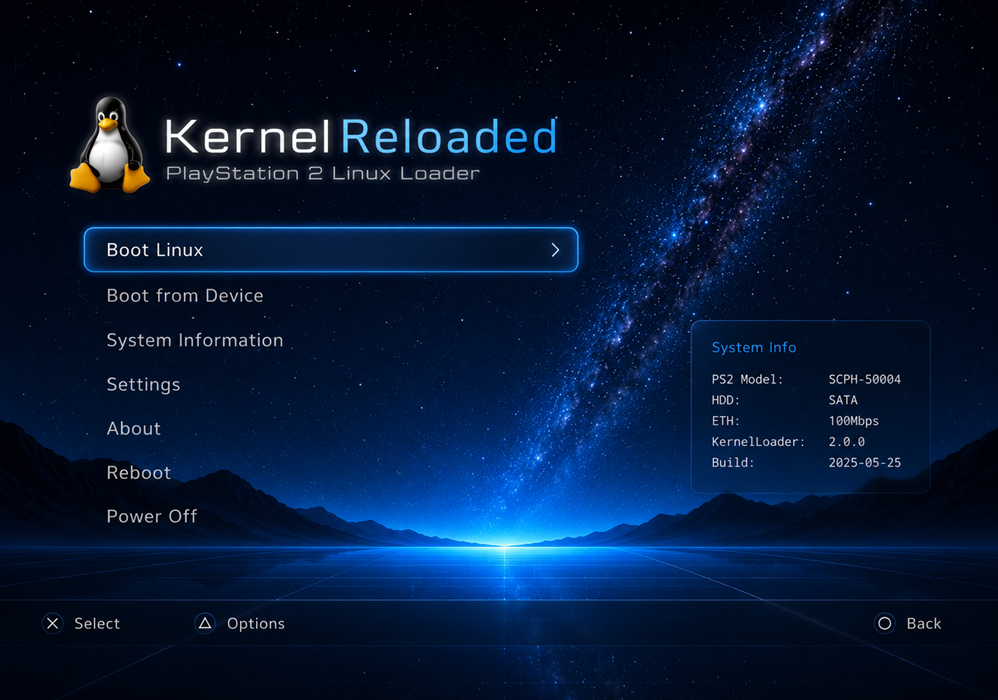

# kernelreloaded

**A continuation of [kernelloader](https://github.com/citronalco/kernelloader),
the PlayStation 2 Linux bootloader** — building again on a modern toolchain.

<sub>Looking for <i>kernelloader ps2 build</i>, <i>kernelloader modern
toolchain</i>, or <i>ps2 linux bootloader</i>? You're in the right place.</sub>



> **A design target, not a screenshot.** The starfield and Tux are real and in
> the build; the rest is where the UI is headed. What that costs splits neatly
> in two:
>
> **Artwork alone** gets the title lockup, the rounded menu highlight, the
> System Info panel and the ×/△/○ glyphs — each becomes a texture drawn with
> the `gsKit_prim_sprite_texture` calls the loader already makes. No new
> rendering code.
>
> **New code** is needed for the menu typography. Dynamic text goes through
> `gsKit_fontm_print_scaled`, and that font lives in the PS2's own BIOS ROM:
> one typeface, scalable, not swappable. Matching the mockup means
> pre-rendering a glyph atlas and writing a small text renderer over
> `sprite_texture`.
>
> And it lands **coarser than it looks** — the PS2 outputs 640×448 (NTSC),
> 640×512 (PAL) or 640×480 (VGA), roughly 2.3× smaller than the image above.

## Why this exists

kernelloader is the standard way to boot Linux on a PlayStation 2. Release 3.0
dates from May 2014, upstream's last commit was **March 2017**, and it does not
build against a current toolchain. This repository provides:

- a **Docker build environment** that compiles it with today's ps2dev image
  (gcc 15, modern ps2sdk, gsKit)
- **patches** carrying the fixes that requires, kept out of the submodule so
  upstream stays clean — see [`patches/README.md`](patches/README.md)
- room for the original goal: a refreshed configurator UI

## The problem that motivated it

kernelloader already searches several places for its config at startup. `mc1:`
is not one of them.

The auto-load is a fallback chain in `loadLoaderModules()` (`loader/modules.c`),
called once from `main.cpp`. One `int lrv` carries the result forward, and each
step runs only if the previous one failed:

| # | Path | Guard |
|---|---|---|
| 1 | `mc0:kloader/config.txt` | fires as soon as MCMAN/MCSERV are loaded |
| 2 | `mass0:PS2NS/CONFIG.TXT` | `load_netsurf_config` |
| 3 | `mass0:CONFIG.TXT` | `load_usb_config` |
| 4 | `cdfs:config.txt` | `load_dvd_config && isDVDVSupported()` |

`CONFIG_DIR2` (`"mc1:kloader"`) is defined in `loader/configuration.h` but
referenced exactly once in the whole codebase — `saveMcIcons(CONFIG_DIR2)`,
reached only when *saving* to a path that already starts `mc1:`. Nothing ever
loads from it. So if FreeMcBoot occupies mc0 and you want everything Linux on
mc1, the config is never found automatically.

You can still get there by hand — Advanced Menu → File Menu → Select Config
File → **"Memory Card 2"** (a real file browser rooted at `mc1:`, so no typing)
→ `kloader/config.txt` → Load Selected Config → Boot — but that is per boot,
because the browser's `configfile` buffer is not itself a persisted config item.

**And no, the ELF cannot take a config path as an argument.** `main.cpp`
accepts exactly `-d`, `--no-cdvd` and `--fix-no-disc`; there is no path
option, so a bootloader cannot hand it one.

The fix is therefore smaller than "add a config search list" — the list exists,
and mc1 needs inserting into it beside step 1. MCMAN and MCSERV serve both
slots, so mc1 is readable at the exact moment mc0 is; no extra module loading
and no reordering. It needed `loader/` to build first, which is what the
toolchain work was for — and it now does.

(Config is not the only thing pinned to mc0 — IOP module overrides are too. See
[`docs/kernelloader-internals.md`](docs/kernelloader-internals.md).)

## Documentation

| Document | Covers |
|---|---|
| [`docs/kernelloader-internals.md`](docs/kernelloader-internals.md) | Boot chain, SBIOS vs kernel stub vs vmlinux, the config system in full (search order, all keys, device prefixes, the `CONFIG_DIR2` trap), build components, the SBIOS memory budget, `config.mk` switches |
| [`docs/build-environment.md`](docs/build-environment.md) | Every Dockerfile layer and why it exists; how ps2sdk's `Rules.make` behaves out-of-tree; the `IOP_INCS` / `IOP_WARNFLAGS` / `PS2SDKSRC` hooks; `build.sh` usage; the stale-object trap |
| [`docs/porting-notes.md`](docs/porting-notes.md) | Every build failure in order, with the actual error and root cause — including the two real bugs gcc 15 uncovered |
| [`patches/README.md`](patches/README.md) | Summary of the 50 patched files, grouped by cause |

## Which kernelloader?

The submodule tracks **[citronalco/kernelloader](https://github.com/citronalco/kernelloader)**,
not rickgaiser's.

Upstream is dead: last commit **2017-03-01**, release 3.0 from May 2014, no open
issues, not archived — just abandoned. Of its seven forks, only citronalco's has
real work: five commits from 2018–2020, including
`loader: fix std & stlport related compilation errors` and a libpng port of
`png2rgb`.

That STLport fix matters. `loader/Makefile` linked `-lstlport`, and modern
ps2sdk no longer ships STLport at all; the fix drops the library and adds `std::`
to nine `vector<` uses, since `-D_STLP_NO_NAMESPACES` had put STLport's `vector`
in the global namespace. Without it, `loader/` cannot link.

Pleasingly, citronalco is also the author of the 2010 ps2dev.org thread on
booting PS2 Linux with an NFS root — the same person, twice, a decade apart.

## Build

Requires Docker. Nothing else — the toolchain lives in the image.

```bash
git submodule update --init --recursive
./build.sh
```

Output lands in `bin/` (gitignored), the same path on WSL2, Linux or Cygwin.

```
./build.sh              # build
./build.sh clean        # make clean + clear bin/
./build.sh shell        # interactive shell in the container
./build.sh <target>     # any other make target
REBUILD_IMAGE=1 ./build.sh   # force the toolchain image to rebuild
```

`build.sh` applies `patches/*.patch` to the submodule first, skipping any
already applied.

## What the environment provides

The upstream `ghcr.io/ps2dev/ps2dev` image ships the cross-toolchain and ps2sdk
but is minimal Alpine. The [`Dockerfile`](Dockerfile) adds:

| | Why |
|---|---|
| `make bash gcc musl-dev` | no `make` in the base image; kernelloader also builds **host** tools (`ppm2rgb`, `png2rgb`) |
| `libpng-dev zlib-dev tiff-dev` | `png2rgb` links libpng; loader wants tiff/zlib |
| `perl coreutils` | `loader/Makefile` derives every embedded image's width/height/depth with a perl one-liner guarded by `cut --complement`. Alpine has neither, and the rule **fails silently** — no dimensions emitted, every texture 0×0, nothing on screen |
| `ee-*` symlinks | Makefiles hardcode `ee-gcc`; ps2sdk renamed everything to `mips64r5900el-ps2-elf-*` |
| `tools/bin2s` on `PATH` | modern ps2sdk dropped `bin2s` (ships `bin2c`, different interface) — 8 call sites need it |
| ps2sdk **source** clone + `PS2SDKSRC` | IOP modules `include $(PS2SDKSRC)/iop/Rules.make`, which ships only in the source repo, not the installed SDK |
| `IOP_INCS` | the source tree keeps IOP headers per-module; out-of-tree modules need the installed flattened `iop/include` |
| `IOP_WARNFLAGS` | `Rules.make` uses `?=`, so the environment can add `-Wno-pointer-sign` without patching every module |

The last two are worth noting: both are environment-level hooks that fix
*every* IOP module at once instead of patching each Makefile.

## Status

**Linux boots to a shell on real hardware.** A slim PSTwo, launched from a USB
stick via wLaunchELF: kernelloader built on gcc 15 hands off to a 2001
MontaVista 2.4.17 kernel, the initrd unpacks, USB enumerates as a SCSI device,
and userspace comes up at a prompt.

Under PCSX2 (v2.6.3) it gets as far as `Freeing initrd memory` and then faults
in the EE MMU — the least-exercised path in the emulator and the first thing
Linux leans on. That is an emulator limit, not a loader one.

Getting there turned up faults that had nothing to do with the four
originally-documented blockers, and two that would have shipped a broken ELF
silently:

| Fault | Why it mattered |
|---|---|
| `linkfile` said `ENTRY(_start)`; modern crt0 defines `__start` | Unresolved entry meant crt0 was **garbage-collected out of the link**. The ELF still built, with its entry pointing at whatever landed first in `.text` and no stack, heap or `.bss` setup. |
| `crc32check.c`'s table was `const`, not `volatile` | gcc 15 constant-folded the comparison to literal `0` and never loaded the value `crc32gen` patches in post-link, so the integrity check could never pass. |
| `pad.c` tested `padInit(0) != 0` | ps2sdk documents `== 1` as success, so it bailed *on success*: no controller, and every "Press CROSS to continue" prompt undismissable. |
| `perl` and GNU `cut --complement` absent from the build image | `rominitialize.h` silently emitted **no** width/height/depth for any image. Every texture was 0×0 — nothing drawn, no error, no clue. |
| gsKit gained a texture manager | The manual `vram_alloc`/`upload`/draw workflow no longer renders. Now uses `gsKit_TexManager_bind()`, following [ps2oom](https://github.com/Arawn-Davies/ps2oom)'s working implementation. |

`fioExit()` turned out **not** to be removed from ps2sdk — it is still in
`ee/include/fileio.h`; `loader.c` simply never included it. `sio_printf()` is
genuinely gone and is reimplemented in `kprint.c`. Full account in
[`docs/porting-notes.md`](docs/porting-notes.md).

### The config search is in

`mc0:kloader/config.txt` then **`mc1:kloader/config.txt`**, inserted beside step
1 of the startup chain — the change this project exists for. MCMAN and MCSERV
serve both slots and are loaded two entries earlier, so it needs no extra module
loading and no reordering. MC1 also gains the Load/Save/Delete menu entries it
never had.

### Three bugs only real hardware could find

Each of these passed under PCSX2 and failed on a console, for structural
reasons rather than bad luck:

| Fault | Why the emulator missed it |
|---|---|
| `intrelay` and `smaprpc` loaded from `host:` | PCSX2 resolves `host:` to the directory the ELF came from, so both quietly succeeded. On a console booted from USB there is no `host:` at all. `intrelay` is now embedded in the ELF; `smaprpc` no longer exists anywhere and its entry is gone. |
| `CDDA_Exit()` hangs the boot | It issues a *blocking* `SifCallRpc` waiting for an SMSCDVD acknowledgement that never arrives. Needs a real IOP that declines to answer. Skipped at all three call sites — the `SifIopReset()` that follows each discards the module regardless. |
| EROM driver failure raised a blocking error screen | Only reachable when `rom1` is present, which the first test BIOS lacked. DVD-Video is optional and now degrades to a log line. |

`smaprpc` is flagged `.slim = 1`, so it only ever fires on a slim PSTwo — a fat
console would have sailed past it.

### Deploying

`./tools/mkusb.sh` assembles a self-contained USB payload. `mass0:CONFIG.TXT` is
already step 3 of the startup search, so a stick needs no memory card:

```
./tools/mkusb.sh          # kloader.elf + CONFIG.TXT + vmlinux.gz + initrd.gz
./tools/mkusb.sh --nfs    # NFS root instead; no initrd
```

Copy the contents of `dist/usb/` to the stick root and launch `kloader.elf` from
wLaunchELF. The NFS mode takes `PS2_IP`, `NFS_IP`, `GATEWAY`, `NETMASK` and
`NFS_EXPORT` from the environment. **NFS boot is built but untested.**

Three things were needed beyond the toolchain work:

| | |
|---|---|
| **SBIOS call table** | kernelloader *disassembles the SBIOS entry code* to recover the table address, matching on `jalr`. gcc 15 tail-jumps with `jr t9`, so the scan never matched and it gave up one step before booting. |
| **`intrelay`** | Deleted upstream in `4ba4d6e` as "obsolete", but upstream's own readme still says **Required: Yes** — it relays IOP interrupts to the EE. Restored from git history and ported (directory rules, doubled `IOP_OBJS_DIR`, `-Werror`). |
| **USB stack** | `usbhdfsd` replaced with **BDM** (`bdm` + `bdmfs_fatfs` + `usbmass_bd`), the stack OPL/Neutrino/NHDDL use — exFAT, GPT as well as MBR, and a route to the internal ATA disk. MX4SIO is available via `MX4SIO = yes`. |

Still to do: the glyph-atlas text renderer, two black video modes (VGA and
480p), and an NFS boot test.

One fix carries a caveat, though a smaller one than it first looked:
`sif1_dmatags` alignment was reduced 64 → 16, because gcc 15 will not express
the original intent. That drops a cache-aliasing protection the comment asks
for — but the original TGE
([ps2homebrew/TGE](https://github.com/ps2homebrew/TGE), 2004) declares that
array with **no alignment attribute at all**, so 16 is still stricter than the
design it shipped with. Flagged in-code and in
[`patches/README.md`](patches/README.md).

## Roadmap

- ~~Get `loader/` building~~ — done
- ~~Land the `mc0:`/`mc1:` config search~~ — done, the reason this project exists
- ~~Verify on real hardware~~ — done; boots to a shell on a slim PSTwo
- ~~Static UI chrome~~ — title lockup, button bar, System Info panel, rounded
  menu highlight and loading bar are all in
- **Glyph-atlas text renderer.** The one remaining piece that needs real new
  code, and the thing blocking everything else: the ROM font is a single fixed
  bitmap face whose only knob is scale, and `gsKit_fontm` cannot measure a
  rendered string — so right-aligned panel values, a centred lockup and text
  that does not clip are all impossible until it exists
- Two black video modes (VGA, 480p). `applyVideoMode()` does not set
  `StartX`/`StartY`/`MagH`/`MagV`, and 480p should be 720×480 not 640×480
- Test the NFS boot mode — built, never run
- Refreshed GUI configurator for kernelloader
- Longer term, fold kernelloader's functions into a unified kernelreloaded UI —
  booting Linux, and possibly other \*nixes (a BSD build reportedly exists)

## Credits

kernelloader is by Mega Man, maintained by
[rickgaiser](https://github.com/rickgaiser/kernelloader); releases live on
[SourceForge](https://sourceforge.net/projects/kernelloader/files/Kernelloader/),
where 3.0 is the latest. That SourceForge project also hosts the BlackRhino
Linux distribution, the PS2 Live Linux DVD/USB images, and Debian 5.0 mipsel.

The Docker layout follows the conventions of my
[ps2oom](https://github.com/Arawn-Davies/ps2oom) PS2 Doom port.
