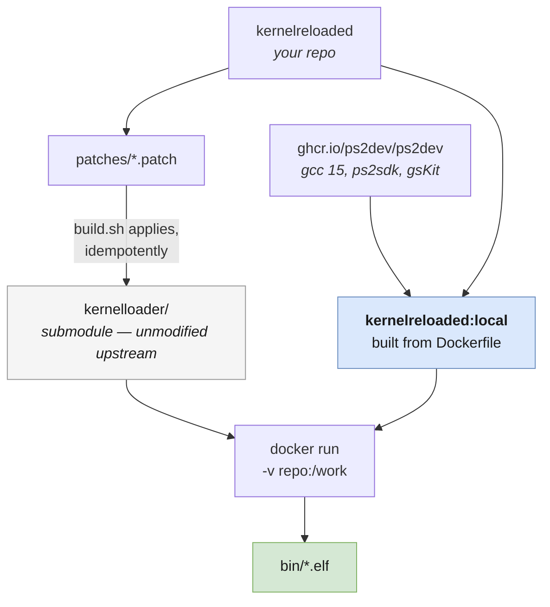

# Build environment

Why the `Dockerfile` looks the way it does, and how ps2sdk's build system
behaves when you build *out of tree*. Every line exists because the build fails
without it.

---

## How a build fits together



The submodule is never modified in git — patches are applied to its working
tree at build time, so it stays a clean checkout that can be rebased on
upstream.

## Base image

```dockerfile
FROM ghcr.io/ps2dev/ps2dev:latest
```

Ships the full PS2 cross-toolchain — `mips64r5900el-ps2-elf-gcc` (currently
gcc **15.2.0**), ps2sdk, gsKit — with `PS2DEV`, `PS2SDK` and `PATH` preset. It
is minimal Alpine: no `make`, no host compiler, no dev headers.

The Docker Hub and GHCR images are the same artifact (identical digest); GHCR
is used for consistency with [ps2oom](https://github.com/Arawn-Davies/ps2oom).

---

## Layer by layer

### Host build tools

```dockerfile
RUN apk add --no-cache make bash gcc musl-dev libpng-dev zlib-dev tiff-dev \
                       perl coreutils
```

`make`/`bash` are simply absent from the base image. The rest are less obvious:
kernelloader builds **host** programs as well as EE code. `ppm2rgb` and
`png2rgb` run on the build machine to convert image assets into embeddable
binary data, so they need a native compiler and libpng. `loader/` links tiff and
zlib on the EE side.

### `perl` and `coreutils` — the silent one

These two are worth calling out, because their absence does not fail the build.
It produces a working ELF that draws nothing.

`loader/Makefile` generates `rominitialize.h`, which carries the width, height
and colour depth of every embedded image:

```make
if [ "`echo $$file | cut -d '_' -f 1 --complement`" = "rgb" ]; then \
    ufile="`echo $$file | perl -n -e \"s/_rgb\$$//g; print uc($$@);\"`"; \
    echo "rom_files[i].width = $${ufile}_WIDTH;" >> rominitialize.h; \
```

Alpine satisfies neither half. Its `cut` is busybox, which rejects
`--complement`, so the guard fails and the block never runs; `perl` is not
installed at all, so it would fail even if the guard passed.

The result: **zero** `width`/`height`/`depth` lines emitted, all three fields
left at 0, and every texture drawn as a 0×0 sprite. No error, no VRAM failure,
nothing on screen, and no indication which of the many plausible causes it was.
`coreutils` supplies GNU `cut`.

This is the same shape as the `bin2s` problem below — a host tool the 2000s
build environment took for granted — but nastier, because `bin2s` fails loudly
and this fails silently. If images ever stop appearing, check
`loader/rominitialize.h` for `width` lines *first*.

### `ee-*` aliases

```dockerfile
RUN for f in /usr/local/ps2dev/ee/bin/mips64r5900el-ps2-elf-*; do
        b=$(basename "$f")
        ln -sf "$f" "/usr/local/bin/ee-${b#mips64r5900el-ps2-elf-}"
    done
```

`kernel/Makefile` sets `CROSS_COMPILE = ee-` and several Makefiles call
`ee-strip`, `ee-objcopy`, `ee-size` directly. Modern ps2sdk renamed everything
to the full target triple. Aliasing in the image fixes every call site at once
and keeps the patch set free of mechanical renames.

### `PS2SDKSRC` — and why the installed SDK is not enough

```dockerfile
RUN apk add --no-cache git \
 && git clone --depth 1 https://github.com/ps2dev/ps2sdk.git /usr/local/src/ps2sdk
ENV PS2SDKSRC=/usr/local/src/ps2sdk
```

IOP modules do:

```make
include $(PS2SDKSRC)/Defs.make
include $(PS2SDKSRC)/iop/Rules.make
```

The **installed** SDK has `Defs.make`, but its `iop/` contains only
`include/ irx/ lib/ startup/` — the build rules ship exclusively in the
**source** repository, where `iop/` also has `Rules.make`, `Rules.bin.make`,
`Rules.lib.make` and `Rules.release`. Hence the clone.

It is deliberately unpinned: the installed SDK carries no commit marker to match
against, and these rule files change rarely. If IOP modules start failing oddly
after an image rebuild, upstream drift here is the first suspect.

### `IOP_INCS` — the flattened-headers problem

```dockerfile
ENV IOP_INCS="-I/usr/local/ps2dev/ps2sdk/iop/include"
```

The two trees lay headers out differently:

```
source    /usr/local/src/ps2sdk/iop/system/threadman/include/thbase.h
installed /usr/local/ps2dev/ps2sdk/iop/include/thbase.h
```

ps2sdk expects IOP modules to be built *inside* its source tree, each declaring
`IOP_IMPORT_INCS` to pull in the sibling modules it needs. Out-of-tree modules
like kernelloader's `sharedmem/` do not, so they miss headers that the installed
SDK provides flattened.

`iop/Rules.make:24` reads:

```make
IOP_INCS := $(IOP_INCS) -I$(IOP_SRC_DIR) ... -I$(PS2SDKSRC)/iop/kernel/include ...
```

It **prepends** whatever is already in `IOP_INCS`, so pointing at the flattened
installed headers fixes every such module at once without touching a single
upstream Makefile.

### `IOP_WARNFLAGS` — dropping `-Werror` for IOP modules

```dockerfile
ENV IOP_WARNFLAGS="-Wall"
```

`iop/Rules.make:34` is `IOP_WARNFLAGS ?= -Wall -Werror` — the `?=` means the
environment wins.

`-Werror` is dropped rather than suppressed warning-by-warning. gcc has grown a
lot of diagnostics since 2003 and this code trips a new class every few files:
`-Wpointer-sign`, `-Wunused-but-set-variable`, `-Wattributes` (`packed` on a
`char` field, which really is a no-op), `-Wunused-variable`. Chasing each with
its own `-Wno-` is whack-a-mole, and every added suppression is a chance to
mask something real.

`-Wall` is kept, so warnings still print on every build and stay reviewable.

Note the EE side is deliberately different: `TGE/sbios` keeps `-Werror` with
narrow, targeted suppressions, because that is exactly where a genuine
out-of-bounds bug surfaced (`mc.c`, see `patches/README.md`).

### `tools/bin2s` on PATH

```dockerfile
ENV PATH="/work/tools:${PATH}"
```

Modern ps2sdk dropped `bin2s` (it ships `bin2c`, which emits a C array with a
different interface). kernelloader calls `bin2s` in **eight** places across
`kernel/`, `RTE/` and `loader/` to embed IRX modules, ELFs and image data.

`tools/bin2s` is a drop-in replacement emitting the classic output — the symbol
plus `_end` and `_size` — using `.incbin` with an absolute path so it does not
depend on the assembler's working directory. It comes from the mounted repo, not
baked into the image, so edits take effect without an image rebuild.

---

## build.sh

Follows the conventions of `ps2oom`: an `IMAGE` variable, a `common[]` array of
`docker run` arguments, and **all output in repo-local `bin/`** so the path is
identical on WSL2, Linux and Cygwin. Nothing host-specific is committed.

```
./build.sh                   build
./build.sh clean             make clean + clear bin/
./build.sh shell             interactive shell, cwd = /work/kernelloader
./build.sh <target> [...]    any other make target
REBUILD_IMAGE=1 ./build.sh   force the toolchain image to rebuild
```

It builds the image on first use and caches it thereafter, then applies
`patches/*.patch` idempotently — checking `git apply --check --reverse` first,
so re-running is safe and an already-patched tree is left alone. If a patch
fails to apply it stops with the expected base commit rather than half-patching.

### Stale objects

`make` decides by timestamp, so a change to a `Makefile` or a header often
relinks without recompiling — which produces confusing "I fixed that already"
moments. Two fixes during the port (`-fno-builtin` in `kernel/`, `-Os` in
`TGE/sbios/`) appeared not to work for exactly this reason. When a flag change
seems to have no effect:

```bash
./build.sh clean && ./build.sh
```

---

## Reproducing from scratch

```bash
git clone https://github.com/Arawn-Davies/kernelreloaded.git
cd kernelreloaded
git submodule update --init --recursive
./build.sh
```

Requires only Docker. The first run pulls the base image (~1 GB) and clones
ps2sdk source into it; subsequent runs reuse the cached image.
