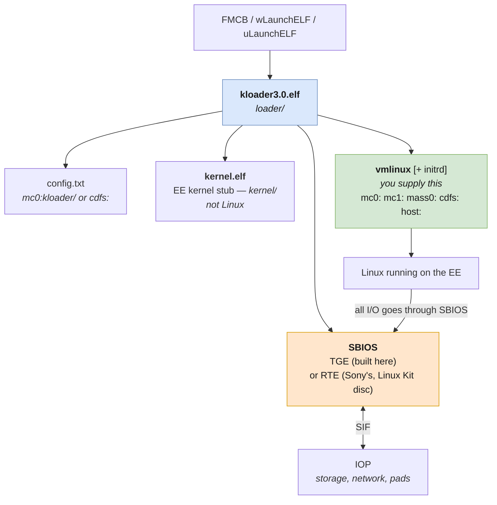
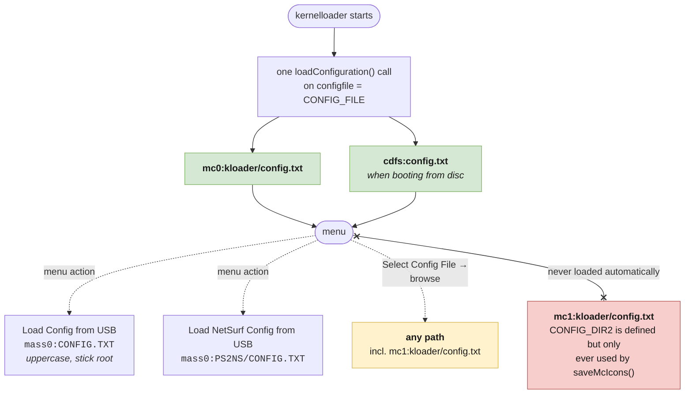
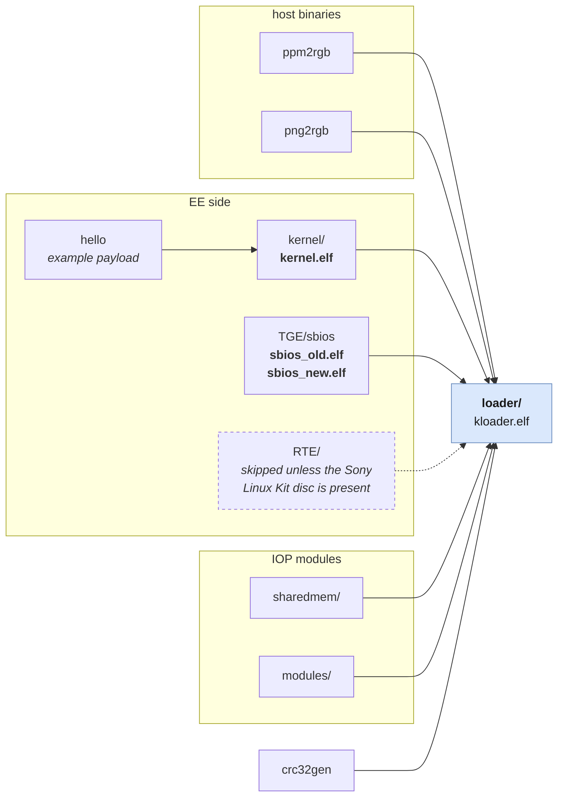

# kernelloader internals

Notes on how kernelloader 3.0 actually works, gathered by reading the source
while porting it. Everything here is from the tree at `ce0fb430`
(rickgaiser/kernelloader master, identical in the relevant parts to the
SourceForge 3.0 release — that release's `kloader3.0.elf` is md5
`3dda261f366a10570529a7ff4d7c5779`).

The upstream `readme.txt` covers usage. This covers structure, because that is
what you need before changing anything.

---

## Boot chain



Three pieces are easy to confuse:

| Piece | What it is |
|---|---|
| **`loader/`** | kernelloader itself — the UI, config handling, file browsers, ELF loading. This is `kloader3.0.elf`. |
| **`kernel/`** | A small EE kernel *stub* built by this project (`kernel.elf`, installed into `loader/`). Not Linux. |
| **`vmlinux`** | The actual Linux kernel, supplied by you, never built here. |

`SBIOS` is the interface between the Emotion Engine and the IOP. Linux runs
directly on the EE and calls SBIOS for I/O. Two implementations exist:

- **TGE** ("The Great Experiment", Marcus R. Brown) — built from source in this
  repository, produces `sbios_old.elf` and `sbios_new.elf` for old and new ROM
  module sets. This is the default.
- **RTE** (Sony's Run Time Environment) — lives on disc 1 of the official
  PlayStation 2 Linux Kit. The top-level Makefile only builds `RTE/` if
  `$(PS2LINUXDVD)/pbpx_955.09` exists. Some functionality (sound, some DMA) is
  reportedly more complete in RTE than TGE.

---

## Configuration

### Where config is read from

Defined in `loader/configuration.h`:

```c
#define CONFIG_DIR        "mc0:kloader"
#define CONFIG_FILE       CONFIG_DIR "/config.txt"    /* mc0:kloader/config.txt */
#define CONFIG_DIR2       "mc1:kloader"
#define DVD_CONFIG_FILE   "cdfs:config.txt"
#define PS2NS_CONFIG_FILE "mass0:PS2NS/CONFIG.TXT"
#define USB_CONFIG_FILE   "mass0:CONFIG.TXT"
```

**Only two of these are loaded automatically at startup.** There is exactly one
`loadConfiguration()` call in the startup path (`loader/loadermenu.cpp:730`),
operating on a `configfile` buffer initialised by
`strcpy(configfile, CONFIG_FILE)` — so `mc0:kloader/config.txt`, with
`cdfs:config.txt` taking over when booting from a disc.

The others are **menu actions only**:

| Menu item | Path |
|---|---|
| Load Config from MC0 | `mc0:kloader/config.txt` |
| Load Config from DVD | `cdfs:config.txt` |
| Load Config from USB | `mass0:CONFIG.TXT` — **uppercase, at the stick root** |
| Load NetSurf Config from USB | `mass0:PS2NS/CONFIG.TXT` |
| Save Config on MC0 | `mc0:kloader/config.txt` |



Solid arrows load automatically; dotted ones need a menu action every boot.

### CONFIG_DIR2 is a trap

`CONFIG_DIR2` (`"mc1:kloader"`) exists but is referenced in exactly one place in
the entire codebase — `saveMcIcons(CONFIG_DIR2)` in `configuration.cpp`. It is
**never used for loading**. There is no "Load Config from MC1" menu item.

So if FreeMcBoot occupies mc0 and you keep everything Linux on mc1, your config
is never found automatically. You can still reach it without typing:

```
Advanced Menu → File Menu → Select Config File → "Memory Card 2"
  → browse to kloader/config.txt → Load Selected Config → Boot Current Config
```

"Memory Card 2" is a real file browser rooted at `mc1:` (`cmc1Param` in
`loadermenu.cpp`), and equivalents exist for the kernel and initrd pickers. But
it is per boot: `configfile` is not itself a persisted configuration item, so it
resets to the mc0 path on every launch.

### No command-line escape hatch

`main.cpp` parses exactly three arguments:

```
-d                debug
--no-cdvd         skip CDVD init
--fix-no-disc     work around no-disc detection
```

There is **no option to pass a config path**, so a bootloader cannot hand
kernelloader one. Changing the search order requires a code change in
`loader/`.

### File format

`loadConfiguration()` (`configuration.cpp:105`) reads line by line, splits on
the first `=`, strips the trailing newline, and matches the left side against a
vector of registered configuration items by `strcmp`. Unknown keys are ignored
silently. Missing keys fall back to built-in defaults.

Registered keys, from `addConfigTextItem`/`addConfigVideoItem` calls:

| Key | Meaning |
|---|---|
| `KernelFileName` | path to `vmlinux` (or `vmlinux.gz`) |
| `KernelParameter` | the kernel command line |
| `InitrdFileName` | path to an initrd, if any |
| `VideoParameter` | video parameters passed on |
| `videomode` | kernelloader's own video mode |
| `IOPResetParameter` | arguments used when resetting the IOP |
| `ps2linkMyIP` | ps2link: this console's address |
| `ps2linkNetmask` | ps2link netmask |
| `ps2linkGatewayIP` | ps2link gateway |
| `ps2DNSIP` | ps2link DNS |

`MAX_INPUT_LEN` is **1024**, so a long `ip=…:…:…:…::eth0 root=/dev/nfs …
nfsroot=…` command line fits comfortably.

Note the `ps2link*` keys configure **ps2link debugging**, not the Linux
networking — Linux gets its address from `KernelParameter` (`ip=…`).

### Device prefixes

`mc0:` `mc1:` `mass0:` `cdfs:` `host:`

No slash after the colon: `mc0:kloader/config.txt`, not `mc0:/kloader/...`.
There is **no `mc?:` wildcard** — kernelloader calls plain `fopen()` and ps2sdk
resolves `mc0:`/`mc1:` as distinct devices. The `?` convention you see in
wLaunchELF and OSDMenu is implemented by those programs themselves, by trying
each card in turn.

---

## Build components



`loader/` embeds everything above as binary blobs via `bin2s`, which is why it
builds last and why almost everything else is a prerequisite for it.

The top-level `Makefile` builds, in order:

| Directory | Produces | Notes |
|---|---|---|
| `ppm2rgb`, `png2rgb` | host binaries | convert image assets at build time |
| `hello` | `hello.elf` | example payload, referenced by `EXAMPLE_ELF` |
| `kernel` | `kernel.elf` → `loader/` | EE kernel stub |
| `sharedmem` | IOP module | shared-memory debug channel |
| `TGE` | `sbios_old.elf`, `sbios_new.elf` → `loader/TGE/` | the SBIOS |
| `RTE` | `sbios.elf` | **skipped** unless `$(PS2LINUXDVD)/pbpx_955.09` exists |
| `modules` | IOP modules | SMSCDVD and friends |
| `crc32gen` | host helper | |
| `loader` | `kloader.elf` | links everything above in as embedded blobs |

`loader/` embeds the SBIOS ELFs, the kernel stub, IRX modules and image assets
as binary blobs via `bin2s`, which is why it builds last and why almost
everything else is a prerequisite for it.

### The SBIOS memory budget

`TGE/sbios/linkfile`:

```
mem(RWX) : ORIGIN = 0x80001000, LENGTH = 0xEFE0
```

`0xEFE0` is `0xF000 - 32` — the last 32 bytes hold the PS2 model number string.
This region **cannot be enlarged**; it is fixed by the memory map. The SBIOS
must fit in 61,408 bytes including `.bss`, which is a live constraint when
compiling with a modern gcc that emits more code than a 2000s one.

`TGE/sbios/Makefile` already handled this for the `new` ROM module variant by
compiling `-Os` instead of `-O2`; the port applies the same to `old`.

---

## config.mk

Project-level switches, read by most sub-Makefiles:

| Option | Effect |
|---|---|
| `PS2LINUXDVD` | path checked for `pbpx_955.09` to decide whether to build RTE |
| `TARGET_IP` | ps2link target used during development |
| `EXAMPLE_ELF` | payload embedded as the example (`../hello/hello.elf`) |
| `DEBUG_OUTPUT_TYPE` | `sio`, `fileio` or `callback` — selects the debug channel |
| `RESET_IOP` | reset the IOP at start |
| `LOAD_PS2LINK` | load ps2link debug modules (only if the IOP is reset) |
| `NEW_ROM_MODULES` | use new ROM modules in the loader |
| `SCREENSHOT` | R1 writes a screenshot to `host:` or `mass0:` |
| `SBIOS_DEBUG` | SBIOS debug output; forces `-Os` because debug code is larger |
| `SHARED_MEM_DEBUG` | build and use the `sharedmem` IOP module |
| `NEW_KERNEL_TOOLCHAIN` | see below |

### NEW_KERNEL_TOOLCHAIN is not what it sounds like

`kernel/Makefile`:

```make
ifeq ($(NEW_KERNEL_TOOLCHAIN),yes)
CROSS_COMPILE = mips64el-linux-gnu-
LINKSCRIPT    = elf32ltsmipn32.x
else
CROSS_COMPILE = ee-
LINKSCRIPT    = linkfile
endif
```

It selects a **generic Linux MIPS cross-compiler**, not "a newer ps2dev". The
ps2dev image does not contain `mips64el-linux-gnu-*`, so this project uses the
`ee-` branch. Some fixes in `patches/0001` simply bring that branch in line with
flags the `yes` branch already had (`-fno-builtin`, `-march=r5900`) — the author
had clearly hit the same issues from the other direction.

---

## Hardware notes worth knowing

From upstream's `readme.txt`, and relevant when deciding where to put files:

- **USB is unstable on slim PSTwo v14 and higher.** Loading `vmlinux` from a
  memory card is safer than from `mass0:` on those consoles.
- **The network cable must be connected, with link, before kernelloader
  starts** if you have a slim or an HDD adapter.
- On a fat PS2 without an HDD adapter, kernelloader will not load the network
  modules at all.
- A USB keyboard is needed to *type* kernel parameters at the console. Putting
  them in `config.txt` avoids that entirely, which is the main reason to use a
  config file at all.
- `ps2ip.irx` and `ps2smap.irx` are mutually exclusive with Linux's own network
  driver; if the IOP tries to use the network the system hangs.
