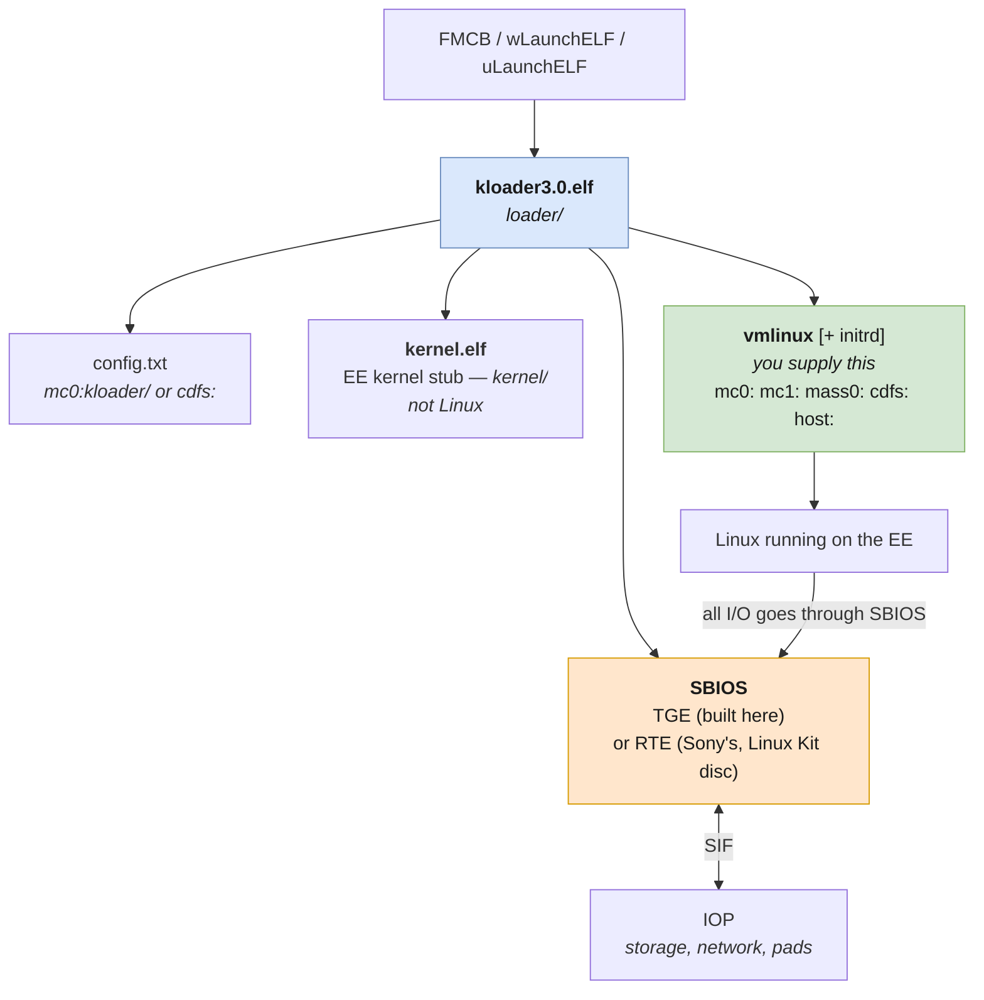
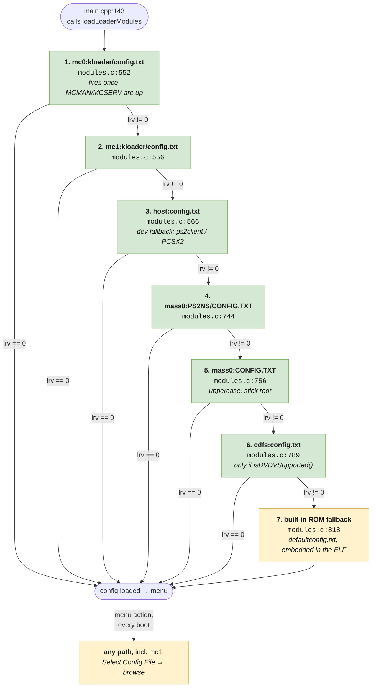
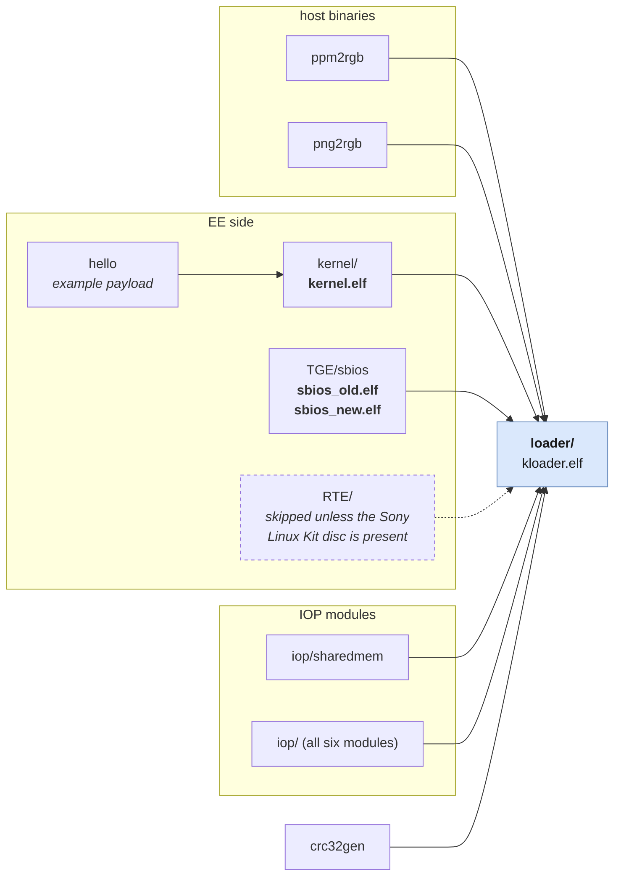

# kernelloader internals

Notes on how kernelloader 3.0 actually works, gathered by reading the source
while porting it. Everything here is from the tree at `ce0fb430`
(rickgaiser/kernelloader master, identical in the relevant parts to the
SourceForge 3.0 release — that release's `kloader3.0.elf` is md5
`3dda261f366a10570529a7ff4d7c5779`).

Upstream's `docs/upstream/readme.txt` covers usage. This covers structure, because that is
what you need before changing anything.

---

## Boot chain



Three pieces are easy to confuse:

| Piece | What it is |
|---|---|
| **`loader/`** | kernelloader itself — the UI, config handling, file browsers, ELF loading. This is `kloader3.0.elf`. |
| **`kernel/`** | A small EE kernel *stub* built by this project (`kernel.elf`, installed into `loader/`). Not Linux. |
| **`vmlinux`** | The actual Linux kernel, supplied by you, never built here. |

`SBIOS` is the interface between the Emotion Engine and the IOP. Linux runs
directly on the EE and calls SBIOS for I/O. Two implementations exist:

- **TGE** ("The Great Experiment", Marcus R. Brown) — built from source in this
  repository, produces `sbios_old.elf` and `sbios_new.elf` for old and new ROM
  module sets. This is the default.

  Note that kernelloader's TGE is **heavily extended**, not a copy. The
  original ([ps2homebrew/TGE](https://github.com/ps2homebrew/TGE), last real
  commit 2004) ships 12 files in `sbios/` — essentially core, misc, sbios,
  sifcmd and sifdma. kernelloader's has **30**, adding memory card, CDVD, pad,
  sound, fileio, iopheap, smod and its own string routines. When judging whether
  something in `TGE/` is an upstream bug or a kernelloader one, check whether
  the file exists upstream at all.
- **RTE** (Sony's Run Time Environment) — lives on disc 1 of the official
  PlayStation 2 Linux Kit. The top-level Makefile only builds `RTE/` if
  `$(PS2LINUXDVD)/pbpx_955.09` exists. Some functionality (sound, some DMA) is
  reportedly more complete in RTE than TGE.

---

## Configuration

### Where config is read from

Defined in `loader/configuration.h`:

```c
#define CONFIG_DIR        "mc0:kloader"
#define CONFIG_FILE       CONFIG_DIR "/config.txt"    /* mc0:kloader/config.txt */
#define CONFIG_DIR2       "mc1:kloader"
#define CONFIG_FILE2      CONFIG_DIR2 "/config.txt"   /* mc1:kloader/config.txt */
#define HOST_CONFIG_FILE  "host:config.txt"
#define DVD_CONFIG_FILE   "cdfs:config.txt"
#define PS2NS_CONFIG_FILE "mass0:PS2NS/CONFIG.TXT"
#define USB_CONFIG_FILE   "mass0:CONFIG.TXT"
```

**Six real sources are tried at startup, as a fallback chain, then a built-in
last resort.** The auto-load lives in `loadLoaderModules()` (`modules.c:334`),
called once from `main.cpp:143`. A single `int lrv = -1` (`modules.c:468`)
carries the result forward, and each later step runs only `if (lrv != 0)` — so
the first file that parses wins and the rest are skipped.

| # | Call site | Path | Additional guard |
|---|---|---|---|
| 1 | `modules.c:552` | `mc0:kloader/config.txt` | the moduleList entry carrying `.loadCfg` |
| 2 | `modules.c:556` | `mc1:kloader/config.txt` | only tried if step 1 fails — **the change this project exists for** |
| 3 | `modules.c:566` | `host:config.txt` | only tried if 1–2 fail; served by `ps2client` or by PCSX2 (relative to the loaded ELF), so it costs nothing on real hardware, where it simply fails to open |
| 4 | `modules.c:744` | `mass0:PS2NS/CONFIG.TXT` | `load_netsurf_config` |
| 5 | `modules.c:756` | `mass0:CONFIG.TXT` — **uppercase, at the stick root** | `load_usb_config` |
| 6 | `modules.c:789` | `cdfs:config.txt` | `load_dvd_config && isDVDVSupported()` |
| 7 | `modules.c:818` | built-in fallback embedded as a ROM file | only if 1–6 all fail — see [`loader/defaultconfig.txt`](../loader/defaultconfig.txt) |

Step 1 is positioned by *readiness*, not by line order. It hangs off the
`.loadCfg = -1` field on the `rom0:PADMAN` entry (`modules.c:143`), whose
comment reads `/* MC modules are loaded before this entry. */` — MCMAN and
MCSERV are loaded two entries earlier, so this is the first moment in the boot
at which a memory card can be read at all.

That detail is why step 2 costs nothing extra: **MCMAN and MCSERV serve both
slots**, so mc1 becomes readable at exactly the same instant mc0 does. It sits
right beside step 1, needing no extra module loading and no reordering — mc0
keeps priority, so an existing mc0-only setup behaves exactly as before.

The `load_*_config` guards for steps 4–6 are function-scope `static int … =
-1`, zeroed on the first pass, as is `.loadCfg`. The chain therefore runs on
the initial boot only and is skipped when the IOP is reset later.



Every real source also has a menu item, which re-runs that one path on demand
through `mcLoadConfig()` regardless of what the startup chain did — useful when
you have inserted a card or stick since boot:

| Menu item | Path |
|---|---|
| Load Config from MC0 | `mc0:kloader/config.txt` |
| Load Config from MC1 | `mc1:kloader/config.txt` |
| Load Config from DVD | `cdfs:config.txt` |
| Load Config from USB | `mass0:CONFIG.TXT` |
| Load NetSurf Config from USB | `mass0:PS2NS/CONFIG.TXT` |

Saving and deleting now have the same mc0/mc1 symmetry: `Save Config on MC0` /
`Save Config on MC1` and `Delete Config on MC0` / `Delete Config on MC1` are
all menu items, alongside `Save Selected Config`, which writes wherever the
file browser is currently pointing.

### Two lines that look like the startup path and are not

Both turn up when grepping for the auto-load, and both are misleading:

| Line | What it actually is |
|---|---|
| `loadermenu.cpp:730` | the `loadConfiguration()` inside `mcLoadConfig()` — a **menu callback**, reached only by pressing a button |
| `loadermenu.cpp:882` | `strcpy(configfile, CONFIG_FILE)` inside `setDefaultConfiguration()` (which begins at `:867`) — it seeds the **file-browser default path**, and loads nothing |

The `configfile` buffer (`loadermenu.cpp:58`) is the browser's current
selection, not an auto-load target. Nothing in the startup path reads it; steps
1–6 above all pass string literals.

### CONFIG_DIR2 was a trap

`CONFIG_DIR2` (`"mc1:kloader"`) used to be referenced in exactly one place in
the entire codebase — `saveMcIcons(CONFIG_DIR2)`, reached only when *saving* to
a path that already begins `mc1:`. It was never used for loading, and there was
no "Load Config from MC1" menu item.

That is fixed now — see the search chain and menu tables above. `CONFIG_FILE2`
(`"mc1:kloader/config.txt"`) is step 2 of the startup chain, and MC1 has full
Load/Save/Delete menu parity with MC0. The file browser fallback below still
works and is worth knowing about, but it is no longer the only way to reach a
config on mc1:

```
Advanced Menu → File Menu → Select Config File → "Memory Card 2"
  → browse to kloader/config.txt → Load Selected Config → Boot Current Config
```

"Memory Card 2" is a real file browser rooted at `mc1:` (`cmc1Param` in
`loadermenu.cpp`), and equivalents exist for the kernel and initrd pickers. It
is per boot: `configfile` is not itself a persisted configuration item, so it
resets to the mc0 path on every launch — but that no longer matters for the
common case, since the startup chain now finds mc1 on its own.

### config.txt is not the only thing pinned to mc0

The search chain fix does not extend to every mc0-only path in the loader — a
config found on mc1 that references modules kernelloader only looks for on mc0
is a half-fix, and this is still true of the current source:

| Site | Count | What it does |
|---|---|---|
| `modules.c:436` | 13 of moduleList's 22 entries | entries with `.checkMc` try `mc0:kloader/<module>.irx` first, falling back to ROM/embedded — the user-override path for IOP modules |
| `loader.c` | 18 entries in `modules[]` | literal `CONFIG_DIR "/…irx"` paths (`init.irx`, `sio2man.irx`, `mcman.irx`, `cdvdman.irx`, `module1-5.irx`, …) |
| `getrte.c:44,55`, `getsbios.c:158`, `getelf.c:103` | 4 | `fileXioMkdir(CONFIG_DIR, …)` and writes *into* `CONFIG_DIR` |

The first two are read paths, still mc0-only regardless of which card the
config itself was found on. The third group writes, so it wants the same
answer the save path already gives: follow whichever card the config actually
came from, as `saveConfiguration()` does at `configuration.cpp:236-257` when it
picks between `CONFIG_DIR` and `CONFIG_DIR2` by inspecting `configfile[2]`.

### No command-line escape hatch

`main.cpp` parses exactly three arguments:

```
-d                debug
--no-cdvd         skip CDVD init
--fix-no-disc     work around no-disc detection
```

There is **no option to pass a config path**, so a bootloader cannot hand
kernelloader one. Changing the search order requires a code change in
`loader/`.

### File format

`loadConfiguration()` (`configuration.cpp:105`) reads line by line, splits on
the first `=`, strips the trailing newline, and matches the left side against a
vector of registered configuration items by `strcmp`. Unknown keys are ignored
silently. Missing keys fall back to built-in defaults.

Registered keys, from `addConfigTextItem`/`addConfigVideoItem`/`addConfigCheckItem`
calls:

| Key | Meaning |
|---|---|
| `KernelFileName` | path to `vmlinux` (or `vmlinux.gz`) |
| `KernelParameter` | the kernel command line |
| `InitrdFileName` | path to an initrd, if any |
| `VideoParameter` | video parameters passed on |
| `videomode` | kernelloader's own video mode |
| `IOPResetParameter` | arguments used when resetting the IOP |
| `AutoBootTime` | seconds before auto-boot (0 = off); config-settable since this port, previously Advanced Menu-only |
| `EnableExtraMem` | config-only, no menu entry — lets a caller that actually knows better (PCSX2/WhiteRhino reading its own `ExtraMemory` setting) say the console has more than retail's 32MB, instead of only the build-time `FAKE_EXTRA_RAM` guess |
| `EnableDev9` | config-only, no menu entry — skips `ps2dev9_init()`/`ata_setup()` entirely when `0`; several seconds under a real console, tens of seconds under PCSX2's EE interpreter, and mandatory on any phat where the EE-side DEV9 register read hangs (see `CLAUDE.md`) |
| `ps2linkMyIP` | ps2link: this console's address |
| `ps2linkNetmask` | ps2link netmask |
| `ps2linkGatewayIP` | ps2link gateway |
| `ps2DNSIP` | ps2link DNS |

`MAX_INPUT_LEN` is **1024**, so a long `ip=…:…:…:…::eth0 root=/dev/nfs …
nfsroot=…` command line fits comfortably.

Note the `ps2link*` keys configure **ps2link debugging**, not the Linux
networking — Linux gets its address from `KernelParameter` (`ip=…`).

### Device prefixes

`mc0:` `mc1:` `mass0:` `cdfs:` `host:`

No slash after the colon: `mc0:kloader/config.txt`, not `mc0:/kloader/...`.
There is **no `mc?:` wildcard** — kernelloader calls plain `fopen()` and ps2sdk
resolves `mc0:`/`mc1:` as distinct devices. The `?` convention you see in
wLaunchELF and OSDMenu is implemented by those programs themselves, by trying
each card in turn.

---

## Build components



`loader/` embeds everything above as binary blobs via `bin2s`, which is why it
builds last and why almost everything else is a prerequisite for it.

The top-level `Makefile` builds, in order:

| Directory | Produces | Notes |
|---|---|---|
| `tools/ppm2rgb`, `tools/png2rgb` | host binaries | convert image assets at build time |
| `tools/hello` | `hello.elf` | example payload, referenced by `EXAMPLE_ELF` |
| `kernel` | `kernel.elf` → `loader/` | EE kernel stub |
| `iop/sharedmem` | IOP module | shared-memory debug channel |
| `TGE` | `sbios_old.elf`, `sbios_new.elf` → `loader/TGE/` | the SBIOS |
| `RTE` | `sbios.elf` | **skipped** unless `$(PS2LINUXDVD)/pbpx_955.09` exists |
| `iop/` | IOP modules | SMSCDVD and friends |
| `tools/crc32gen` | host helper | |
| `loader` | `kloader.elf` | links everything above in as embedded blobs |

`loader/` embeds the SBIOS ELFs, the kernel stub, IRX modules and image assets
as binary blobs via `bin2s`, which is why it builds last and why almost
everything else is a prerequisite for it.

### The SBIOS memory budget

`TGE/sbios/linkfile`:

```
mem(RWX) : ORIGIN = 0x80001000, LENGTH = 0xEFE0
```

`0xEFE0` is `0xF000 - 32` — the last 32 bytes hold the PS2 model number string.
This region **cannot be enlarged**; it is fixed by the memory map. The SBIOS
must fit in 61,408 bytes including `.bss`, which is a live constraint when
compiling with a modern gcc that emits more code than a 2000s one.

`TGE/sbios/Makefile` already handled this for the `new` ROM module variant by
compiling `-Os` instead of `-O2`; the port applies the same to `old`.

---

## config.mk

Project-level switches, read by most sub-Makefiles:

| Option | Effect |
|---|---|
| `PS2LINUXDVD` | path checked for `pbpx_955.09` to decide whether to build RTE |
| `TARGET_IP` | ps2link target used during development |
| `EXAMPLE_ELF` | payload embedded as the example (`../tools/hello/hello.elf`) |
| `DEBUG_OUTPUT_TYPE` | `sio`, `fileio` or `callback` — selects the debug channel |
| `RESET_IOP` | reset the IOP at start |
| `LOAD_PS2LINK` | load ps2link debug modules (only if the IOP is reset) |
| `MX4SIO` | load the MX4SIO block driver (SD in a memory card slot); default `no` — with no adapter fitted the module hangs the load loop instead of returning, which is what happens under PCSX2, so only set `yes` for a build destined for a console that has one |
| `NEW_ROM_MODULES` | use new ROM modules in the loader |
| `SCREENSHOT` | R1 writes a screenshot to `host:` or `mass0:` |
| `SBIOS_DEBUG` | SBIOS debug output; forces `-Os` because debug code is larger |
| `PAD_MOVE_SCREEN` | move the screen with the analog stick |
| `SHARED_MEM_DEBUG` | build and use the `iop/sharedmem` IOP module |
| `NEW_KERNEL_TOOLCHAIN` | see below |
| `FAKE_EXTRA_RAM` | tell Linux the console has more than retail's 32MB (default `64`); emulation only — the memory has to actually exist, which under PCSX2 means `ExtraMemory=true`. Blank for a real-hardware build. See "Pretending to have more RAM" in `CLAUDE.md` |
| `INSTANT_BOOT_DEFAULT` | see below |

### NEW_KERNEL_TOOLCHAIN is not what it sounds like

`kernel/Makefile`:

```make
ifeq ($(NEW_KERNEL_TOOLCHAIN),yes)
CROSS_COMPILE = mips64el-linux-gnu-
LINKSCRIPT    = elf32ltsmipn32.x
else
CROSS_COMPILE = ee-
LINKSCRIPT    = linkfile
endif
```

It selects a **generic Linux MIPS cross-compiler**, not "a newer ps2dev". The
ps2dev image does not contain `mips64el-linux-gnu-*`, so this project uses the
`ee-` branch. Some of the port's fixes simply bring that branch in line with
flags the `yes` branch already had (`-fno-builtin`, `-march=r5900`) — the author
had clearly hit the same issues from the other direction.

### INSTANT_BOOT_DEFAULT skips the menu entirely

Blank/unset for a normal build, which behaves exactly as documented above:
`main()` runs the config search, then the interactive menu, with `AutoBootTime`
(from whichever config source won, or `0` from the built-in fallback) deciding
whether to wait for a pad press.

Set, it adds `-DINSTANT_BOOT_DEFAULT` (`loader/Makefile`) and `main.cpp` takes
a completely different first branch — `loaderConfig.instantBoot = 1` and
`bootlogBegin()` fire before `crc32check()`, before any module loads, before
config.txt can be read at all. This build **never calls `initMenu()`** and
proceeds straight to `real_loader()` once modules and config have loaded,
regardless of what `AutoBootTime` says — a config that sets `AutoBootTime=0` on
this build still does not stop at a menu, because the runtime check that would
honor that value never runs.

This is not a general-purpose flag. It exists for `tools/pcsx2`'s `kload`
feature: `whiterhino/tools/build-kloader-resource.sh` builds this variant
specifically, alongside a normal `kloader.elf`, and `kload` chooses between the
two at its own boot time via `-kload-instant`. Building it any other way means
a `kloader.elf` that ignores its own config's `AutoBootTime` and boots whatever
`KernelFileName`/`InitrdFileName` it finds — including `loader/defaultconfig.txt`'s
`host:vmlinux.gz` fallback if no real config source has one, which reads as a
stuck or misconfigured loader if you don't know this flag is set.

---

## Hardware notes worth knowing

From upstream's `docs/upstream/readme.txt`, and relevant when deciding where to put files:

- **USB is unstable on slim PSTwo v14 and higher.** Loading `vmlinux` from a
  memory card is safer than from `mass0:` on those consoles.
- **The network cable must be connected, with link, before kernelloader
  starts** if you have a slim or an HDD adapter.
- On a fat PS2 without an HDD adapter, kernelloader will not load the network
  modules at all.
- A USB keyboard is needed to *type* kernel parameters at the console. Putting
  them in `config.txt` avoids that entirely, which is the main reason to use a
  config file at all.
- `ps2ip.irx` and `ps2smap.irx` are mutually exclusive with Linux's own network
  driver; if the IOP tries to use the network the system hangs.

Found the hard way, on hardware, on 2026-08-16:

**The DEV9 revision register must never be read from the EE on a slim PSTwo.**
`DEV9_REG(DEV9_R_REV)` hangs the console dead — not slowly, not returning
nonsense — and it does so wherever in the boot it is read: cold during module
buffering, after `ps2dev9.irx` has started on the IOP, or from the paint path.
It was reached all three ways before the cause was understood, because **PCSX2
answers 0 and carries on**, so nothing about it is visible under emulation.

Upstream never reads it on a slim either. `ps2dev9_init()` is called from the
non-slim branch of `real_loader()`, guarded by `enableDev9 && hasNetworkSupport()`.
That is the correct design rather than an oversight: a slim has the adapter
built in, so the chassis genuinely does imply presence, and only a fat is
ambiguous — CXD9611 expansion bay, CXD9566 PCMCIA card, or, for most of them,
neither. So `dev9Matches()` in `loader.c` probes a fat and assumes a slim, and
the System Info panel shows only what the probe has already answered from
somewhere safe, never asking itself.

The known gap: a 75K/79K had the SPEED chip removed and wants
`intrelay-direct-rpc`, but nothing readable from the EE distinguishes it from a
70K. That is upstream's behaviour today too, so this is no worse — it would
need the ROM version to discriminate.

Two consequences worth remembering when adding anything that touches DEV9:

- The paint path runs before `nvram_init()` fills `ps2_console_type`, so
  `modelGeneration()` falls back to the ROM version and **a slim reads as a fat
  on those first frames**. Any "if fat, probe" written in a draw function will
  therefore probe on a slim.
- Assuming DEV9 on a slim is right for a console and wrong under an emulator
  with none configured, where the IOP refuses `smaprpc` with `-200`. That is why
  `smaprpc` is `.optional`: only networking is lost, and a queued error would
  otherwise strand the boot on a pad prompt at Buffer check.
