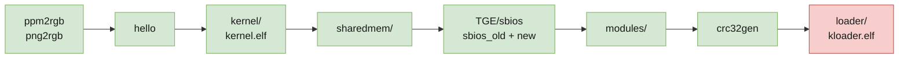

# Porting notes

Every failure hit while getting kernelloader to build with gcc 15 and a modern
ps2sdk, in the order the build hits them, with the actual error and why it
happens. Kept because the errors are mostly *not* obvious from their message,
and because several point at real bugs rather than portability noise.

`patches/README.md` is the summary. This is the long version.



Green builds. `loader/` — the component that actually needs changing — is last,
because everything before it is embedded into it; it now compiles and shows
genuine porting work rather than the STLport wall.

---

## Host tools

### `make: not found`

The ps2dev base image is minimal Alpine with the cross-toolchain only.
`apk add make bash`.

### `cc: No such file or directory` building `ppm2rgb`

kernelloader builds host programs too — `ppm2rgb` and `png2rgb` convert image
assets at build time. `apk add gcc musl-dev`.

### `png.h: No such file or directory`

`apk add libpng-dev zlib-dev tiff-dev`.

### `invalid use of incomplete typedef 'png_info'`

```
png2rgb.c:103:33: error: invalid use of incomplete typedef 'png_info'
  103 |  memset(dest, 0, info_ptr->width * info_ptr->height * *depth);
```

**libpng made `png_info` opaque in 1.5.** Sixteen direct member accesses had to
move to accessors:

| Was | Now |
|---|---|
| `info_ptr->width` | `png_get_image_width(png_ptr, info_ptr)` |
| `info_ptr->height` | `png_get_image_height(png_ptr, info_ptr)` |
| `info_ptr->color_type` | `png_get_color_type(png_ptr, info_ptr)` |
| `info_ptr->row_pointers[y]` | `png_get_rows(png_ptr, info_ptr)[y]` |
| `info_ptr->pixel_depth` | `png_get_bit_depth() * png_get_channels()` — no accessor exists; this is how libpng derived it internally |

`png_infopp_NULL` and `png_voidp_NULL` were also removed in 1.6 → plain `NULL`.
`<string.h>` added for `memset`, which `-Werror-implicit-function-declaration`
otherwise rejects.

---

## `kernel/` — the EE kernel stub

### `ee-gcc: No such file or directory`

`kernel/Makefile` sets `CROSS_COMPILE = ee-`. Modern ps2sdk renamed the tools to
`mips64r5900el-ps2-elf-*`. Fixed in the image with symlinks rather than in the
patch — see [`build-environment.md`](build-environment.md).

### `cc1: error: unsupported combination: -mgp64 -mno-odd-spreg`

`-mips3` forces `-mgp64`, which collides with the r5900 target's default
`-mno-odd-spreg` on gcc 15. Replaced with `-march=r5900`, which is also required
for the assembler to accept the MMI opcodes gcc emits.

### `bin2s: No such file or directory`

Modern ps2sdk ships `bin2c` instead. Eight call sites need `bin2s`, so
`tools/bin2s` reimplements it.

### `error: width of 'pad01' exceeds its type` — ~300 times, in `gs.h`

```c
uint64_t CLAMP:  1 __attribute__((packed));
uint64_t pad01: 63 __attribute__((packed));
```

Two causes stacked, and the first masked the second.

**Member-level `packed`.** Modern gcc treats `__attribute__((packed))` on a
bitfield as "use the smallest allocation unit", shrinking the underlying type
so a 63-bit field no longer fits. Stripped from ~600 declarations across
`kernel/gs.h` and `loader/gs.h`; the 49 **struct-level** `packed` attributes per
file are retained, and those are the ones that matter for layout.

**`uint64_t` was not 64 bits.** `kernel/stdint.h`:

```c
#ifdef PS2_EE
typedef unsigned /*long*/ long uint64_t;   /* i.e. "unsigned long" */
```

`long` is 64-bit only under `-mgp64`, which the removed `-mips3` had been
supplying. Under the n32 ABI that modern ps2dev gcc targets, `long` is 32-bit —
so `uint64_t` was silently half-width. Changed to `long long`, which is 64-bit
under either ABI. Same for `int64_t`.

This is the single most important fix in the set, and it recurs in TGE below.

### `initialization of 'volatile uint64_t *' from incompatible pointer type 'long unsigned int *'`

Fallout from the above — five casts of the form
`(unsigned long *) HARDWARE_ADDR` assigned to `volatile uint64_t *`, in
`graphic.c`, `intc.c`, `dmac.c`, `irq.c`. Changed to cast to the declared type,
which is ABI-independent.

### `Error: opcode not supported on this processor: mips3 (mips3) 'pextlw'`

Inline assembly in `graphic.c` does `.set mips3` and then uses `pextlw`, an
r5900 MMI instruction. The old EE assembler tolerated MMI in mips3 mode; modern
binutils does not. `.set arch=r5900`.

### `undefined reference to 'puts'`

gcc rewrites `printf("literal\n")` into `puts()`, which does not exist in this
`-nostdlib` kernel. `-fno-builtin` — which the `NEW_KERNEL_TOOLCHAIN` branch of
the same Makefile already set, for the same reason.

> This one appeared not to fix anything at first: `make` relinked without
> recompiling, because only the Makefile had changed. See "Stale objects" in
> [`build-environment.md`](build-environment.md).

**`kernel.elf` builds after this.**

---

## `sharedmem/` — an IOP module

### `/Defs.make: No such file or directory`

`$(PS2SDKSRC)` was unset, so the include expanded to `/Defs.make`. Set in the
image.

### `iop/Rules.make: No such file or directory`

Setting `PS2SDKSRC` to the *installed* SDK is not enough — the IOP build rules
ship only in the ps2sdk **source** repository. The image now clones it.

### `thbase.h: No such file or directory`

The source tree keeps IOP headers per-module
(`iop/system/threadman/include/thbase.h`); the installed SDK flattens them into
`iop/include/`. Solved with `IOP_INCS`, which `Rules.make` prepends — one
environment variable instead of patching every module.

### `implicit declaration of function 'printf'`

Modern ps2sdk headers no longer pull `<stdio.h>` in transitively.

**`sharedmem` builds after this.**

---

## `TGE/` — the SBIOS

`-Werror` is on here, so warnings that were survivable elsewhere are fatal.

### `mismatch in argument 2 type of built-in function 'vsnprintf'`

The freestanding `stdio.h` declares an `int` length where gcc's builtin expects
`size_t`. `-fno-builtin-snprintf -fno-builtin-vsnprintf`, matching the file's
existing selective `-fno-builtin-memcpy -fno-builtin-memset` style, keeps the
local prototypes authoritative without changing any signature.

### `unknown type name 'u128'` *and* `size of array element is not a multiple of its alignment`

Two errors, one cause. `tge_types.h`:

```c
#if defined(R5900) || defined(_R5900)
typedef unsigned int u128 __attribute__((mode(TI)));
#endif
```

Old `ee-gcc` predefined `R5900`/`_R5900`. Modern gcc defines
`_MIPS_ARCH_R5900` instead, so `u128` vanished — which malformed
`iop_dmatag_t` and produced a bogus alignment error alongside the real one.
`-D_R5900` restores it.

### `alignment of array elements is greater than element size`

```c
/* Must be cache line size aligned to prevent cache aliasing effects. */
static ee_dmatag_t sif1_dmatags[32] __attribute__((aligned(64)));
```

gcc 15 applies the attribute to the **element type**, demanding 64-byte
elements. A `struct`/`union` wrapper does not help — gcc propagates the
alignment to the member.

Reducing to `aligned(16)` still failed, which exposed the underlying bug:
`tge_types.h` had the **same `long`/`long long` defect** as `kernel/stdint.h`,
so `ee_dmatag_t` (`u32` + `u32` + `u64`) was **12 bytes rather than the
hardware-mandated 16**. With `u64` corrected the struct is right, and
`aligned(16)` is exact.

> ⚠ **The cache-aliasing protection the comment asks for is not preserved.**
> There is no way to express "align the array start to 64" via attributes that
> gcc 15 accepts. If SIF1 DMA misbehaves on real hardware, look here first.
>
> **Later comparison against the original TGE softens this considerably.**
> [ps2homebrew/TGE](https://github.com/ps2homebrew/TGE) (2004) declares both
> tag arrays with *no alignment attribute whatsoever*:
>
> ```c
> static ee_dmatag_t  sif1_dmatags[32];
> static iop_dmatag_t iop_dmatags[32];
> ```
>
> The `aligned(64)` was added later by kernelloader, so `aligned(16)` remains
> **stricter than the design this code originally shipped with**.

### `pointer targets in assignment ... differ in signedness`

`-Wno-pointer-sign`. Benign signedness mismatches throughout 2003-era SIF/DMA
code; casting at dozens of call sites would be riskier than suppressing.

### `lvalue required as left operand of assignment`

```c
for (rid = 0; rid < len; rid++, (u8 *)packet += 64) {
```

A **cast-as-lvalue** — a GNU C extension removed in gcc 4.0. Rewritten as
`packet = (SifRpcPktHeader_t *)((u8 *)packet + 64)`, preserving the 64-byte
stride (which is deliberately not `sizeof(*packet)`).

### `array subscript 20 is above array bounds of 'const int[17]'` — a real bug

```c
mcRpcCmd[mcType][MC_FUNC_CHG_PRITY]       /* mc.c:1140 */
static const int mcRpcCmd[2][17]          /* mc.c:66   */
```

`MC_FUNC_CHG_PRITY` is `0x14` = **20**, against a 17-entry table. That table is
indexed by `MC_RPCCMD_*` everywhere else — the comment above it literally reads
`// mcRpcCmd[MC_TYPE_??][MC_RPCCMD_???]` — and it has **no `CHG_PRITY` entry at
all**. The wrong enum family was used.

This is a **pre-existing out-of-bounds read** that gcc 15 newly detects, not
something this port introduced. Fixing it properly needs the correct MCSERV
command byte, which is not in this tree, so it is **demoted with
`-Wno-error=array-bounds` and deliberately not silenced** — it still warns on
every build.

`mc.c` does not exist in the original TGE at all — memory card support is one
of kernelloader's additions — so this is kernelloader's bug to fix, not
something to report upstream to TGE.

### `dereferencing type-punned pointer will break strict-aliasing rules`

The SBIOS type-puns through pointer casts throughout — hardware registers, SIF
packets, sound registers. At `-O2` gcc both warns and is entitled to optimise on
the assumption. `-fno-strict-aliasing` is the correct answer for code like this;
rewriting every pun via `memcpy` or unions would be a large, untestable change.

### `Error: macro used $at after ".set noat"`

```asm
sh  $v0, 0xBA000000
```

Storing to an absolute address is a macro; the assembler materialises the
address via `$at`, forbidden by the file's `.set noat`. Wrapped in
`.set at` / `.set noat`.

### `undefined reference to 'strcmp'`

The SBIOS links `-nostdlib` and provides its own string routines one per file
(`strlen.S`, `strcpy.S`, `strncpy.S`, `memcpy.S`, `memset.S`, `memcmp.S`) — but
never had `strcmp`. Older toolchains satisfied it from libgcc or by inlining a
builtin. Added `TGE/sbios/strcmp.c` in plain C: the neighbours are
quadword-optimised newlib assembly, but `strcmp` is called only on short module
names at startup, so clarity beats speed.

### `section '.bss' will not fit in region 'mem' — overflowed by 2992 bytes`

`TGE/sbios/linkfile`:

```
mem(RWX) : ORIGIN = 0x80001000, LENGTH = 0xEFE0    /* 0xF000 - 32 */
```

The region **cannot grow** — the last 32 bytes hold the PS2 model number
string. Two pressures combined: gcc 15 emits more code than a 2000s toolchain,
and correcting `u64` to a true 64 bits enlarged every `u64` in static data.

Fixed by compiling the `old` variant `-Os` instead of `-O2` — the same remedy
the Makefile already applied to the `new` variant, with the comment *"SBIOS for
new module is larger and need to be optimized for size."*

**`sbios_old.elf` and `sbios_new.elf` build after this.**

---

## `modules/` — where it currently stops

### `'packed' attribute ignored for field of type 'u8[8]'`

gcc now warns when `packed` is applied to fields that are already suitably
aligned, and `-Werror` is on.

### `request for member 'stat' in something not a structure or union`

```c
lpBuf->stat.mode = FIO_SO_IFREG;    /* SMSCDVD_UDFS.c:638 */
```

ps2sdk's fileio structures changed shape. This is genuine **API drift** rather
than a flag or a language-standard issue, and it is where the port currently
stands.

---

---

## `modules/` — cleared

### `request for member 'stat' in something not a structure or union`

`fio_dirent_t` is the old SDK's name and exists nowhere in current ps2sdk. The
`stat` errors cascade from that unknown type. Modern `io_common.h` defines an
identically-shaped `io_dirent_t`:

```c
typedef struct { io_stat_t stat; char name[256]; void *privdata; } io_dirent_t;
```

### 18 more cast-as-lvalues, and a trap worth knowing

`SMSCDVD.c` steps through a disc TOC cache with
`(char *) tocEntryPointer += tocEntryPointer->m_Length`.

The mechanical rewrite is **wrong** unless the RHS is parenthesised:

```c
/* WRONG — the cast binds tighter than +, so n is scaled by
   sizeof(struct dirTocEntry) instead of counting bytes */
p = (struct dirTocEntry *)cache + n;

/* right */
p = (struct dirTocEntry *)(cache + n);
```

The first version compiles cleanly and silently corrupts pointer arithmetic in
disc-cache code. This port made exactly that mistake on the first pass and
caught it on inspection, not from any diagnostic.

### `-Werror` dropped for IOP modules

Four warning classes broke the build in a row — `-Wpointer-sign`,
`-Wunused-but-set-variable`, `-Wattributes` (`packed` on a `char` field, a
genuine no-op), `-Wunused-variable`. Adding a `-Wno-` for each is whack-a-mole
that also risks masking a real one, so `IOP_WARNFLAGS` is now just `-Wall`:
every warning still prints, none halts the build.

The EE side is treated differently — `TGE/sbios` keeps `-Werror` with narrow,
targeted suppressions, because that is where the genuine out-of-bounds bug in
`mc.c` surfaced.

---

## `loader/` — where it stops now

`-Werror` had to go here too, and for a telling reason: with `-W` (`-Wextra`)
it fails inside **ps2sdk's own headers**. `rom0_info.h` and `osd_config.h` trip
`-Wunused-parameter` about twenty times before any kernelloader source is
reached. `-Werror-implicit-function-declaration` is kept.

Remaining, all genuine:

- **Missing `<stdlib.h>`/`<malloc.h>`** — `memalign`, `free`, `realloc`, `atoi`
  are all implicitly declared.
- **`fioExit()`** — a removed ps2sdk fileio API; needs a modern equivalent
  rather than a flag.
- **Three incompatible-pointer-type call sites** — `disableSBIOSCalls`,
  `load_file`, and an `int`-to-`char *` assignment. These need reading, not
  suppressing.
- **`loader/stdint.h` collides with newlib's** `sys/_stdint.h`, giving
  conflicting `int32_t`/`uint32_t`/`int64_t`/`uint64_t`. Some files include
  `"stdint.h"` and others `<stdint.h>` while `-I.` is in effect, so which one
  wins varies by file. Pre-existing; only visible now that newlib defines these
  types itself.

Worth remembering: the change this port exists to enable — a `mc0:`/`mc1:`
config search — lives **entirely in `loader/`**.
