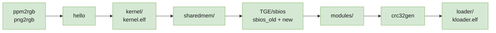

# Porting notes

Every failure hit while getting kernelloader to build with gcc 15 and a modern
ps2sdk, in the order the build hits them, with the actual error and why it
happens. Kept because the errors are mostly *not* obvious from their message,
and because several point at real bugs rather than portability noise.

`patches/README.md` is the summary. This is the long version.



All green: the whole chain builds and `kloader.elf` boots. `loader/` — the
component that actually needs changing — is last, because everything before it
is embedded into it.

Note that "builds" was never the finish line. Several of the worst faults here
compiled and linked perfectly and only showed up at runtime; two of them
produced an ELF that looked entirely plausible. Those are collected under
[Runtime](#runtime--what-only-showed-up-once-it-booted) below.

---

## Host tools

### `make: not found`

The ps2dev base image is minimal Alpine with the cross-toolchain only.
`apk add make bash`.

### `cc: No such file or directory` building `ppm2rgb`

kernelloader builds host programs too — `ppm2rgb` and `png2rgb` convert image
assets at build time. `apk add gcc musl-dev`.

### `png.h: No such file or directory`

`apk add libpng-dev zlib-dev tiff-dev`.

### `invalid use of incomplete typedef 'png_info'`

```
png2rgb.c:103:33: error: invalid use of incomplete typedef 'png_info'
  103 |  memset(dest, 0, info_ptr->width * info_ptr->height * *depth);
```

**libpng made `png_info` opaque in 1.5.** Sixteen direct member accesses had to
move to accessors:

| Was | Now |
|---|---|
| `info_ptr->width` | `png_get_image_width(png_ptr, info_ptr)` |
| `info_ptr->height` | `png_get_image_height(png_ptr, info_ptr)` |
| `info_ptr->color_type` | `png_get_color_type(png_ptr, info_ptr)` |
| `info_ptr->row_pointers[y]` | `png_get_rows(png_ptr, info_ptr)[y]` |
| `info_ptr->pixel_depth` | `png_get_bit_depth() * png_get_channels()` — no accessor exists; this is how libpng derived it internally |

`png_infopp_NULL` and `png_voidp_NULL` were also removed in 1.6 → plain `NULL`.
`<string.h>` added for `memset`, which `-Werror-implicit-function-declaration`
otherwise rejects.

---

## `kernel/` — the EE kernel stub

### `ee-gcc: No such file or directory`

`kernel/Makefile` sets `CROSS_COMPILE = ee-`. Modern ps2sdk renamed the tools to
`mips64r5900el-ps2-elf-*`. Fixed in the image with symlinks rather than in the
patch — see [`build-environment.md`](build-environment.md).

### `cc1: error: unsupported combination: -mgp64 -mno-odd-spreg`

`-mips3` forces `-mgp64`, which collides with the r5900 target's default
`-mno-odd-spreg` on gcc 15. Replaced with `-march=r5900`, which is also required
for the assembler to accept the MMI opcodes gcc emits.

### `bin2s: No such file or directory`

Modern ps2sdk ships `bin2c` instead. Eight call sites need `bin2s`, so
`tools/bin2s` reimplements it.

### `error: width of 'pad01' exceeds its type` — ~300 times, in `gs.h`

```c
uint64_t CLAMP:  1 __attribute__((packed));
uint64_t pad01: 63 __attribute__((packed));
```

Two causes stacked, and the first masked the second.

**Member-level `packed`.** Modern gcc treats `__attribute__((packed))` on a
bitfield as "use the smallest allocation unit", shrinking the underlying type
so a 63-bit field no longer fits. Stripped from ~600 declarations across
`kernel/gs.h` and `loader/gs.h`; the 49 **struct-level** `packed` attributes per
file are retained, and those are the ones that matter for layout.

**`uint64_t` was not 64 bits.** `kernel/stdint.h`:

```c
#ifdef PS2_EE
typedef unsigned /*long*/ long uint64_t;   /* i.e. "unsigned long" */
```

`long` is 64-bit only under `-mgp64`, which the removed `-mips3` had been
supplying. Under the n32 ABI that modern ps2dev gcc targets, `long` is 32-bit —
so `uint64_t` was silently half-width. Changed to `long long`, which is 64-bit
under either ABI. Same for `int64_t`.

This is the single most important fix in the set, and it recurs in TGE below.

### `initialization of 'volatile uint64_t *' from incompatible pointer type 'long unsigned int *'`

Fallout from the above — five casts of the form
`(unsigned long *) HARDWARE_ADDR` assigned to `volatile uint64_t *`, in
`graphic.c`, `intc.c`, `dmac.c`, `irq.c`. Changed to cast to the declared type,
which is ABI-independent.

### `Error: opcode not supported on this processor: mips3 (mips3) 'pextlw'`

Inline assembly in `graphic.c` does `.set mips3` and then uses `pextlw`, an
r5900 MMI instruction. The old EE assembler tolerated MMI in mips3 mode; modern
binutils does not. `.set arch=r5900`.

### `undefined reference to 'puts'`

gcc rewrites `printf("literal\n")` into `puts()`, which does not exist in this
`-nostdlib` kernel. `-fno-builtin` — which the `NEW_KERNEL_TOOLCHAIN` branch of
the same Makefile already set, for the same reason.

> This one appeared not to fix anything at first: `make` relinked without
> recompiling, because only the Makefile had changed. See "Stale objects" in
> [`build-environment.md`](build-environment.md).

**`kernel.elf` builds after this.**

---

## `sharedmem/` — an IOP module

### `/Defs.make: No such file or directory`

`$(PS2SDKSRC)` was unset, so the include expanded to `/Defs.make`. Set in the
image.

### `iop/Rules.make: No such file or directory`

Setting `PS2SDKSRC` to the *installed* SDK is not enough — the IOP build rules
ship only in the ps2sdk **source** repository. The image now clones it.

### `thbase.h: No such file or directory`

The source tree keeps IOP headers per-module
(`iop/system/threadman/include/thbase.h`); the installed SDK flattens them into
`iop/include/`. Solved with `IOP_INCS`, which `Rules.make` prepends — one
environment variable instead of patching every module.

### `implicit declaration of function 'printf'`

Modern ps2sdk headers no longer pull `<stdio.h>` in transitively.

**`sharedmem` builds after this.**

---

## `TGE/` — the SBIOS

`-Werror` is on here, so warnings that were survivable elsewhere are fatal.

### `mismatch in argument 2 type of built-in function 'vsnprintf'`

The freestanding `stdio.h` declares an `int` length where gcc's builtin expects
`size_t`. `-fno-builtin-snprintf -fno-builtin-vsnprintf`, matching the file's
existing selective `-fno-builtin-memcpy -fno-builtin-memset` style, keeps the
local prototypes authoritative without changing any signature.

### `unknown type name 'u128'` *and* `size of array element is not a multiple of its alignment`

Two errors, one cause. `tge_types.h`:

```c
#if defined(R5900) || defined(_R5900)
typedef unsigned int u128 __attribute__((mode(TI)));
#endif
```

Old `ee-gcc` predefined `R5900`/`_R5900`. Modern gcc defines
`_MIPS_ARCH_R5900` instead, so `u128` vanished — which malformed
`iop_dmatag_t` and produced a bogus alignment error alongside the real one.
`-D_R5900` restores it.

### `alignment of array elements is greater than element size`

```c
/* Must be cache line size aligned to prevent cache aliasing effects. */
static ee_dmatag_t sif1_dmatags[32] __attribute__((aligned(64)));
```

gcc 15 applies the attribute to the **element type**, demanding 64-byte
elements. A `struct`/`union` wrapper does not help — gcc propagates the
alignment to the member.

Reducing to `aligned(16)` still failed, which exposed the underlying bug:
`tge_types.h` had the **same `long`/`long long` defect** as `kernel/stdint.h`,
so `ee_dmatag_t` (`u32` + `u32` + `u64`) was **12 bytes rather than the
hardware-mandated 16**. With `u64` corrected the struct is right, and
`aligned(16)` is exact.

> ⚠ **The cache-aliasing protection the comment asks for is not preserved.**
> There is no way to express "align the array start to 64" via attributes that
> gcc 15 accepts. If SIF1 DMA misbehaves on real hardware, look here first.
>
> **Later comparison against the original TGE softens this considerably.**
> [ps2homebrew/TGE](https://github.com/ps2homebrew/TGE) (2004) declares both
> tag arrays with *no alignment attribute whatsoever*:
>
> ```c
> static ee_dmatag_t  sif1_dmatags[32];
> static iop_dmatag_t iop_dmatags[32];
> ```
>
> The `aligned(64)` was added later by kernelloader, so `aligned(16)` remains
> **stricter than the design this code originally shipped with**.

### `pointer targets in assignment ... differ in signedness`

`-Wno-pointer-sign`. Benign signedness mismatches throughout 2003-era SIF/DMA
code; casting at dozens of call sites would be riskier than suppressing.

### `lvalue required as left operand of assignment`

```c
for (rid = 0; rid < len; rid++, (u8 *)packet += 64) {
```

A **cast-as-lvalue** — a GNU C extension removed in gcc 4.0. Rewritten as
`packet = (SifRpcPktHeader_t *)((u8 *)packet + 64)`, preserving the 64-byte
stride (which is deliberately not `sizeof(*packet)`).

### `array subscript 20 is above array bounds of 'const int[17]'` — a real bug

```c
mcRpcCmd[mcType][MC_FUNC_CHG_PRITY]       /* mc.c:1140 */
static const int mcRpcCmd[2][17]          /* mc.c:66   */
```

`MC_FUNC_CHG_PRITY` is `0x14` = **20**, against a 17-entry table. That table is
indexed by `MC_RPCCMD_*` everywhere else — the comment above it literally reads
`// mcRpcCmd[MC_TYPE_??][MC_RPCCMD_???]` — and it has **no `CHG_PRITY` entry at
all**. The wrong enum family was used.

This is a **pre-existing out-of-bounds read** that gcc 15 newly detects, not
something this port introduced. Fixing it properly needs the correct MCSERV
command byte, which is not in this tree, so it is **demoted with
`-Wno-error=array-bounds` and deliberately not silenced** — it still warns on
every build.

`mc.c` does not exist in the original TGE at all — memory card support is one
of kernelloader's additions — so this is kernelloader's bug to fix, not
something to report upstream to TGE.

### `dereferencing type-punned pointer will break strict-aliasing rules`

The SBIOS type-puns through pointer casts throughout — hardware registers, SIF
packets, sound registers. At `-O2` gcc both warns and is entitled to optimise on
the assumption. `-fno-strict-aliasing` is the correct answer for code like this;
rewriting every pun via `memcpy` or unions would be a large, untestable change.

### `Error: macro used $at after ".set noat"`

```asm
sh  $v0, 0xBA000000
```

Storing to an absolute address is a macro; the assembler materialises the
address via `$at`, forbidden by the file's `.set noat`. Wrapped in
`.set at` / `.set noat`.

### `undefined reference to 'strcmp'`

The SBIOS links `-nostdlib` and provides its own string routines one per file
(`strlen.S`, `strcpy.S`, `strncpy.S`, `memcpy.S`, `memset.S`, `memcmp.S`) — but
never had `strcmp`. Older toolchains satisfied it from libgcc or by inlining a
builtin. Added `TGE/sbios/strcmp.c` in plain C: the neighbours are
quadword-optimised newlib assembly, but `strcmp` is called only on short module
names at startup, so clarity beats speed.

### `section '.bss' will not fit in region 'mem' — overflowed by 2992 bytes`

`TGE/sbios/linkfile`:

```
mem(RWX) : ORIGIN = 0x80001000, LENGTH = 0xEFE0    /* 0xF000 - 32 */
```

The region **cannot grow** — the last 32 bytes hold the PS2 model number
string. Two pressures combined: gcc 15 emits more code than a 2000s toolchain,
and correcting `u64` to a true 64 bits enlarged every `u64` in static data.

Fixed by compiling the `old` variant `-Os` instead of `-O2` — the same remedy
the Makefile already applied to the `new` variant, with the comment *"SBIOS for
new module is larger and need to be optimized for size."*

**`sbios_old.elf` and `sbios_new.elf` build after this.**

---

## `modules/` — cleared

### `'packed' attribute ignored for field of type 'u8[8]'`

gcc now warns when `packed` is applied to fields that are already suitably
aligned, and `-Werror` is on.

### `request for member 'stat' in something not a structure or union`

`fio_dirent_t` is the old SDK's name and exists nowhere in current ps2sdk. The
`stat` errors cascade from that unknown type. Modern `io_common.h` defines an
identically-shaped `io_dirent_t`:

```c
typedef struct { io_stat_t stat; char name[256]; void *privdata; } io_dirent_t;
```

### 18 more cast-as-lvalues, and a trap worth knowing

`SMSCDVD.c` steps through a disc TOC cache with
`(char *) tocEntryPointer += tocEntryPointer->m_Length`.

The mechanical rewrite is **wrong** unless the RHS is parenthesised:

```c
/* WRONG — the cast binds tighter than +, so n is scaled by
   sizeof(struct dirTocEntry) instead of counting bytes */
p = (struct dirTocEntry *)cache + n;

/* right */
p = (struct dirTocEntry *)(cache + n);
```

The first version compiles cleanly and silently corrupts pointer arithmetic in
disc-cache code. This port made exactly that mistake on the first pass and
caught it on inspection, not from any diagnostic.

### `-Werror` dropped for IOP modules

Four warning classes broke the build in a row — `-Wpointer-sign`,
`-Wunused-but-set-variable`, `-Wattributes` (`packed` on a `char` field, a
genuine no-op), `-Wunused-variable`. Adding a `-Wno-` for each is whack-a-mole
that also risks masking a real one, so `IOP_WARNFLAGS` is now just `-Wall`:
every warning still prints, none halts the build.

The EE side is treated differently — `TGE/sbios` keeps `-Werror` with narrow,
targeted suppressions, because that is where the genuine out-of-bounds bug in
`mc.c` surfaced.

---

## `loader/` — cleared, and it boots

`-Werror` had to go here too, and for a telling reason: with `-W` (`-Wextra`)
it fails inside **ps2sdk's own headers**. `rom0_info.h` and `osd_config.h` trip
`-Wunused-parameter` about twenty times before any kernelloader source is
reached. `-Werror-implicit-function-declaration` is kept.

### `loader/stdint.h` — do this one first

It was listed last of four blockers. It should have been first, because it is
not merely a name collision:

```c
typedef unsigned /*long*/ long uint64_t;   /* -> "unsigned long" */
```

The **same 64-bit defect already fixed twice** in `kernel/stdint.h` and
`tge_types.h`, still present here because `loader/` had never built far enough
to surface it. gcc confirms it: `previous declaration of 'uint64_t' with type
'uint64_t' {aka 'long unsigned int'}` — 32-bit under n32.

That matters because `loader/gs.h` got the same 600-line `packed` strip as
`kernel/gs.h`, and 36 of its GS register-packing macros shift a `uint64_t` by
32–56 bits. On a 32-bit type every field above bit 31 is discarded.

It hid in the one place it was harmless: the conflict only errors in
translation units that pull newlib's `sys/_stdint.h` (`loader.c` does, via
`zlib.h`). Units that do not got the 32-bit version and compiled clean.

Fixed by **deleting `loader/stdint.h`**. Its only content newlib does not
provide is `uint128_t`/`int128_t`, referenced nowhere in `loader/`; with the
file gone, `-I.` lets all ten include sites fall through to newlib's.

### `fioExit()` was never removed

Recorded here as a removed API. It is not — it is declared in ps2sdk's
`ee/include/fileio.h`. `loader.c` simply never included that header; older SDKs
pulled it in transitively. Same for `fioRemove`/`fioRmdir`/`fioPutc`. The whole
category was six missing `#include`s across `loader.c`, `modules.c`,
`loadermenu.cpp`, `kprint.c` and the three `get*.c` files.

`fileio.h` and `fileXio_rpc.h` are guarded by `#ifndef NEWLIB_PORT_AWARE`, an
opt-in acknowledgement that mixing fileio with newlib's POSIX layer on the same
file can desynchronise. kernelloader does not do that, so `-DNEWLIB_PORT_AWARE`
is set in `loader/Makefile`.

### `sio_printf()` genuinely is gone

Modern `sio.h` keeps `sio_putc`/`puts`/`putsn`/`write` but has no formatted
variant. `main.cpp`, `crc32check.c` and `iopmem.c` all call it. Reimplemented in
`kprint.c` over `sio_putsn()` — deliberately not via `kputs()`, which also
mirrors to `iop_putc`/`fioPutc` where the original never did.

### `-Dwint_t=int` is fatal on gcc 15

`EE_CXXFLAGS` carried a set of STLport workarounds. modern ps2sdk ships no
STLport at all, so they are vestigial — but `-Dwint_t=int` is actively fatal:
gcc 15's `stddef.h` does `typedef __WINT_TYPE__ wint_t;`, which the define
rewrites to `typedef unsigned int int;` — "multiple types in one declaration",
before any source is read.

### `gsFontM::Texture` became an array

```c
GSTEXTURE *Texture[GS_FONTM_PAGE_COUNT];   /* was a single GSTEXTURE * */
```

`gsFont->Texture->Clut` no longer compiles, and freeing only `[0]` would leak
the other seven CLUTs on every video mode change.

---

## The link stage — two silent failures

Both produced a plausible-looking ELF. Neither reported anything useful.

### `ENTRY(_start)` — crt0 silently garbage-collected

`loader/linkfile` names `_start`; modern ps2sdk's crt0 defines **`__start`**.
The symbol never resolved, so ld warned once and defaulted the entry to
`0x1000000` — and, because an unresolved `ENTRY` leaves nothing rooting it,
**crt0 was collected out of the link entirely**. The result still linked, still
packed, and would have jumped into whatever code happened to sit first in
`.text` with no stack, heap or `.bss` setup.

Verified both ways on a trivial program: with `_start` there is no `__start`
symbol in the output at all; with `__start`, crt0 is retained and the ELF entry
matches it.

> The `crt0.o` prerequisite in `Makefile.eeglobal` is separate and genuinely
> vestigial — the recipe never referenced it, and modern ps2sdk ships no
> prebuilt `crt0.o` (`ee/startup/` holds only `linkfile`).

### `tools/bin2s` — wrong symbol names, wrong section directive

Two faults in this repo's own replacement:

- It emitted `.section .data`. `loader/Makefile` post-processes bin2s output
  with `sed -e "s/\.data/.section .rom/g"`, turning that into
  `.section .section .rom` — "junk at end of line". The original emitted a bare
  `.data`.
- It named the size symbol `<sym>_size`. `romdefinitions.h` declares
  `extern int size_<sym>;`. Everything assembles and links right up to the final
  ELF, then fails with ~30 `undefined reference to 'size_*'`.

---

## Runtime — what only showed up once it booted

Building was not the end of it. These were found by running `kloader.elf` in
PCSX2 (v2.6.3, PAL v1.60 BIOS).

### The CRC check could never pass

`crc32gen` patches a CRC into the `.crc32` section after linking. `crc32check.c`
declared the table `const` with `.crc` implicitly `0`, so gcc 15 constant-folded
every comparison to literal `0` and emitted no load at all. The ELF on disk was
correctly patched (`0x038413d4`) while the running code compared against
`0x00000000`.

`volatile const` forces the runtime load. **Any table patched after linking must
be `volatile`** — older compilers happening to keep the load is not something to
rely on.

### `padInit()` returns 1 on success

`pad.c` tested `!= 0`, so it treated the documented success value as failure,
returned before `padPortOpen()` and left the loader with no controller — which
also makes every "Press CROSS to continue" prompt undismissable.

### Region detection assumed NVRAM was readable

The EROM driver path is region-suffixed, and the letter came from NVRAM alone.
Any console or emulator whose NVRAM reads back blank produced a nonsense path
and a blocking error screen. ROMVER is the better source and is already read at
startup: its layout is `VVVVRTYYYYMMDD`, so `0160EC20011004` gives `E`. NVRAM is
still preferred when it holds a plausible letter; ROMVER is the fallback. A
missing EROM driver is now logged rather than blocking — it only means no
DVD-Video playback.

The error message there also had **six conversions and five arguments**, so its
trailing `(%s)` printed stack garbage.

### Every texture was 0×0

The one that cost the most time, and the least interesting cause.

`loader/Makefile` generates `rominitialize.h`, carrying each embedded image's
width/height/depth. That rule guards the image fields with
`cut -d '_' -f 1 --complement` and derives the macro prefix with a **perl**
one-liner. The Alpine image had neither: busybox `cut` rejects `--complement`,
so the guard failed and the block never ran; `perl` was absent too.

The build succeeded and emitted **zero** width/height/depth lines. All three
fields stayed 0, so every sprite drew at zero size — no error, no VRAM failure,
independent of pixel format and of which upload path was taken.

Three plausible hypotheses were tested and falsified before this was found (the
inline slice-upload path, `png2rgb`'s alpha inversion, and an uninitialised
`GSTEXTURE::Delayed`). What actually located it was one `kprintf` of each
texture's dimensions at load. **Print the values before reasoning about the
mechanism.**

Fixed in the image: `apk add perl coreutils`.

### gsKit gained a texture manager

Independently, the manual workflow this code used — `gsKit_vram_alloc()` a slot,
`gsKit_texture_upload()` into it, draw — is no longer how modern gsKit works. It
expects `gsKit_TexManager_bind()` before use; the manager owns VRAM and decides
what to upload. `ps2oom`'s `doomgeneric_ps2_gs.c` drives the same gsKit on the
same toolchain and was the reference: `gsKit_TexManager_init()` after each
`gsKit_init_screen()`, `bind()` per draw, `nextFrame()` after each flip,
`Texture->Vram = 0`.

That retired the height-slicing machinery, the `gsKit_texture_upload_inline()`
helper (whose `lastMem`/`lastVram` cache was never assigned, so it never
actually cached), and the `globalVram` scratch buffer — which had also been
denying 196 KB of VRAM to the manager.

Both changes landed together, so it is **not established** whether the manual
path would work now that dimensions are correct.

---

---

## Booting Linux — three more toolchain casualties

Building and reaching the menu was not the end either. Getting as far as handing
control to the kernel turned up three more.

### The SBIOS call table: `jr` vs `jalr`

The worst of the lot, because it fails at the very last step.

kernelloader does not read the SBIOS call table address from a header. It
**disassembles the SBIOS's own entry code at runtime**, walking instructions and
maintaining a shadow register file, looking for the `jalr` that dispatches
through the table:

```c
if ((value & 0x3f) == 9) {          /* jalr */
    if (load[rs] != 0) jumpBase = load[rs];
```

The 2003 compiler emitted `jalr`. gcc 15 tail-jumps:

```
lui   v1,0x8001
sll   v0,v0,0x2
addiu v1,v1,-31800
addu  v0,v0,v1
lw    t9,0(v0)
jr    t9          <- funct 8, not jalr's funct 9
```

So the scan never matched, `jumpBase` stayed 0, and the loader stopped with
"SBIOS call table not found" *after* successfully loading everything else.
Teaching the scanner `jr` (and `sll`, which indexes the table) resolves it
immediately: `0x800083c8`.

This is a category of breakage worth naming: **the loader introspects compiled
code, so changing compiler changes its input.** Nothing about it is visible at
build time.

### `intrelay` was deleted upstream, and is not obsolete

`loader.c` references `host:TGE/intrelay-direct.irx` but nothing in the tree
builds it. rickgaiser removed it in `4ba4d6e` ("Remove irx modules no longer
needed") with the note `intrelay -> obsolete`, alongside `dmarelay`, `eedebug`
and `smaprpc` — the last two having moved to the `linux-firmware-ps2` repo.

It is not obsolete for the 2.4.17-era kernels this loader targets. Upstream's
own `readme.txt` is unambiguous: *"Redirects interrupts from IOP to EE.
Required: Yes."* Without it the loader gets as far as the kernel and stops.

Restored from git history (`git show 4ba4d6e^:TGE/iop/intrelay/...`) and ported:

- `Rules.make` no longer supplies rules creating `IOP_OBJS_DIR`/`IOP_BIN_DIR`,
  so `all` failed with "No rule to make target 'obj-direct/'". The four variants
  need separate object directories because each is built with different `-D`
  flags, so they cannot build in place the way `modules/SMSCDVD` does.
- `iop/Rules.make:85` now applies the object directory itself
  (`IOP_OBJS := $(IOP_OBJS:%=$(IOP_OBJS_DIR)%)`), so the Makefile's own
  `addprefix` produced `obj-direct/obj-direct/intrelay.o`.
- `-Werror` dropped, as everywhere else on the IOP side.

`dmarelay` is deliberately **not** restored — upstream states it does not work.

### What the handoff looks like when it works

For reference, the tail of a successful handoff under PCSX2:

```
TLBs flushed.
Jump to kernel!
sbcall_cdvdinit stage 0
...
sbcall_cdvdinit stage 6
TLB Miss, pc=0x800af838 addr=0xc0000070 [store]
```

`Jump to kernel!` is the last thing kernelloader prints. The `sbcall_*` lines
after it come from **Linux calling into the SBIOS** — the clearest possible
confirmation that the kernel is executing and that the SBIOS built here answers
it.

The TLB misses that follow are at `0xc00000xx`, i.e. **kseg2** — the mapped
segment Linux uses for vmalloc and other kernel mappings, which by design must
be resolved through the EE TLB. Under PCSX2 this is where the boot stops and the
emulator falls over.

That is a known weak spot rather than anything wrong with the loader: the EE
MMU/TLB is barely exercised by games, so it is the least-tested path in the
emulator, while Linux leans on it from its first moments. **Real hardware is the
next test, not more emulator work** — and note that everything up to
`Jump to kernel!` is fully verified, so a hardware attempt starts from a known
good position.

### The USB stack was 20 years old

`usbhdfsd.irx` is FAT16/FAT32 only and predates BDM entirely. Replaced with the
Block Device Manager stack that OPL, Neutrino and NHDDL use:

```
bdm.irx          manager; no dependencies beyond the kernel
bdmfs_fatfs.irx  filesystem; imports bdm and ioman -> exFAT, via FatFs
usbd.irx         USB host stack
usbmass_bd.irx   USB block device; imports bdm and usbd
```

Load order follows those import lists and must not be reshuffled. `bdm` also
ships GPT *and* MBR partition drivers, and `bdmfs_fatfs` registers as `"mass"`
with a note that it "uses global connection order for full backward
compatibility", so existing `mass0:` paths keep working.

`mx4sio_bd.irx` (SD card in a memory card slot) is the same kind of transport
and is supported, but is **opt-in** via `MX4SIO = yes` in `config.mk`: it drives
SIO2 directly rather than through sio2man, and with no adapter fitted it does
not return — it hangs the module loading loop and the loader never reaches its
menu. That is exactly what happens under PCSX2.

---

## Runtime, part two — what only real hardware could find

Three faults passed cleanly under PCSX2 and failed on a console. None was bad
luck; each was structural, and worth knowing before trusting an emulator run.

### `host:` resolves to something under emulation and nothing on a console

`loader.c` writes every module path in its `modules[]` table as `host:`.
kernelloader searches the embedded ROM first, with the device prefix stripped,
so `host:ps2ip.irx` finds the embedded `ps2ip.irx` and never touches `host:` at
all. Modules that are *not* embedded fall through to the real `host:` device —
which PCSX2 maps to the directory the ELF was loaded from, and which does not
exist at all on a console booted from USB.

Two modules were in that position:

- **`intrelay`** — required, and now embedded in the ELF (added to `ROM_FILES`).
- **`smaprpc`** — no longer exists anywhere to embed; entry removed, along with
  `ps2smap` and `ps2link`. It is flagged `.slim = 1`, so it only ever fired on a
  slim PSTwo; a fat console would never have reached it.

The lesson generalises: **under PCSX2, a missing `host:` file is indistinguishable
from a present one.** Any new module path needs checking against a console, or
embedding.

### A blocking RPC needs a real IOP to not answer

Reboot, and later the Linux boot, hung with "Stopping DVD" on screen. Splitting
that one status message into one per call pinned it immediately:

```
Stopping DVD: CDVD_Stop          -> returns
Stopping DVD: CDVD_FlushCache    -> returns
Stopping DVD: CDDA_Exit          -> never returns
```

`CDDA_Exit()` issues a blocking `SifCallRpc` (mode 0) asking the SMSCDVD IOP
module to shut down, and waits for an acknowledgement that never arrives. Under
emulation the RPC completed; on hardware it does not.

It is redundant at all three call sites regardless — each is followed by a
`SifIopReset()` that discards the module wholesale, so asking it to exit first
buys nothing, and the EE-side semaphore it would delete does not outlive the
reset. (`reloadModules()` looks different but reaches the same reset via
`loadLoaderModules()`, `modules.c:455`.)

### A better BIOS moved a failure rather than fixing it

The EROM driver load failure raised a blocking error screen — but only when
`rom1` is present, so switching PCSX2 to a BIOS with `ROM1`/`ROM2` files
*introduced* it. With `rom1` absent, `open("rom1:EROMDRV")` fails and control
falls to the region-detection path, which was already non-blocking. With `rom1`
present, the open succeeds, `modules.c` concludes "old fat PS2", strips the
region letter, and the *load* fails on a different branch that still had
`error_printf`.

Both routes end in "no DVD-Video", which is optional. Both now log and continue.

---

## What actually worked, as a method

Two bugs cost most of the time in this port, and both yielded to the same thing:

- **Every texture drew at 0×0** — three hypotheses were tested and falsified
  (the inline upload path, `png2rgb`'s alpha inversion, an uninitialised
  `GSTEXTURE::Delayed`) before one `kprintf` of each texture's dimensions at
  load found it in seconds.
- **"Hangs in DVD teardown"** — became a single word the moment three calls
  behind one status message were given three messages.

Reasoning from the source was wrong more often than right: the `sifrpc` packet
stride, the `u64` widths on the RPC path, and `gsKit_TexManager_init` were all
plausible, all argued from the code, and all wrong.

**Print the values before reasoning about the mechanism.** On a platform with no
debugger and a serial log, a `kprintf` is worth an hour of inference.

---

Worth remembering: the change this port exists to enable — a `mc0:`/`mc1:`
config search — lived **entirely in `loader/`**, and is now done. It is a
handful of lines beside step 1 of the startup chain; every other line in this
document was the cost of being able to write them.
